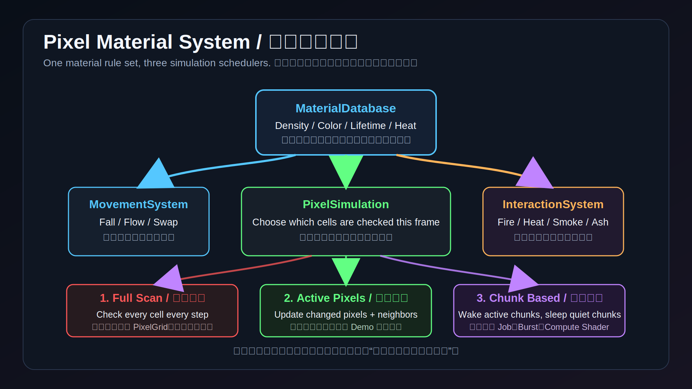

# Pixel Material System 讲解提纲

## 核心目标

本期不再为每一种物质单独写一套模拟代码，而是把物质拆成两层：

- `MaterialDatabase`：材料参数表，决定密度、颜色、移动方式、生命周期、燃点、燃烧结果。
- `MovementSystem` / `InteractionSystem`：通用系统，只读取参数，不关心具体是 Sand、Water 还是 Smoke。

这样后续增加 Acid、Oil、Steam、Lava 时，优先新增 `MaterialType` 和一条 `MaterialDefinition`。

## 当前材料

- Air：可被任何流动物质占据。
- Sand：高密度粉末，向下、斜下移动，可在 Water 中下沉。
- Water：液体，向下、斜下、横向扩散。
- Smoke：低密度气体，向上漂浮，遇到顶部或阻挡时横向扩散。
- Fire：有生命周期，持续释放温度，点燃周围可燃材料。
- Stone：静态固体，阻挡像素和玩家。
- Wood：静态可燃物，被 Fire 加热后转为 Fire，燃尽后生成 Smoke 或 Ash。
- Ash：低密度粉末，用来展示燃烧后的残留物。

## 第三期核心：同一套材料规则，三种调度模式

这期压力测试的重点不是重新写水，而是证明同一套 Pixel Material System 可以换不同的“调度方式”。

中心逻辑：

- `MaterialDatabase` 仍然决定材料参数：密度、颜色、移动方式、生命周期、燃点、燃烧结果。
- `MovementSystem` 仍然只处理移动：下落、流动、交换、密度关系。
- `InteractionSystem` 仍然只处理交互：燃烧、温度、生命周期、Smoke、Ash。
- `PixelSimulation` 新增调度模式：决定这一帧到底检查哪些格子。

三种模式：

- `Full Scan / 全图扫描`：每个模拟步扫描整张 `PixelGrid`。最直观，也最容易掉帧，适合展示朴素元胞自动机的成本。
- `Active Pixels / 活跃像素`：只更新发生变化的像素和邻居。水移动、燃烧、温度变化、生命周期变化都会唤醒附近区域。
- `Chunk Based / 区块更新`：把地图切成固定大小 Chunk，只扫描 active chunk。比 Active Pixels 粗一些，但更适合未来扩展到 Job System、Burst、Compute Shader。

一张图理解中心内容：

## 演示玩法

玩法原型：元素炼金救援。

玩家进入一个像素洞穴，用材料笔刷改变环境：

- 用 Sand 堵水、填坑、压入水池观察下沉。
- 用 Water 改变流向或阻断火势。
- 用 Fire 点燃 Wood，观察热扩散、连锁燃烧、Smoke 上升、Ash 掉落。
- 用 Stone 搭平台，引导玩家穿过洞穴。
- 用 Smoke 展示气体遇顶扩散。

这是一个适合短视频展示的循环：玩家制造问题，系统给出涌现反应，玩家再利用反应解题。

## 操作

- A / D 或方向键：移动玩家。
- Space / W / 上方向键：跳跃。
- 鼠标左键：绘制当前材料。
- 鼠标右键：擦除为空气。
- 鼠标滚轮：调整笔刷大小。
- Ctrl + 鼠标滚轮：缩放镜头。
- 1：Sand
- 2：Water
- 3：Smoke
- 4：Fire
- 5：Stone
- 6：Wood
- 0：Air
