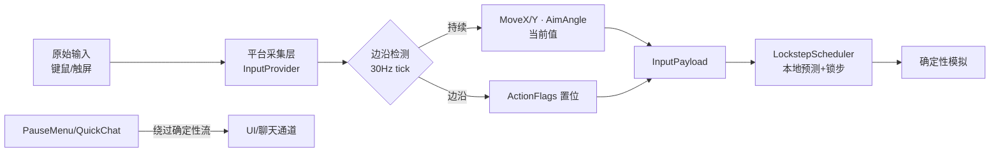
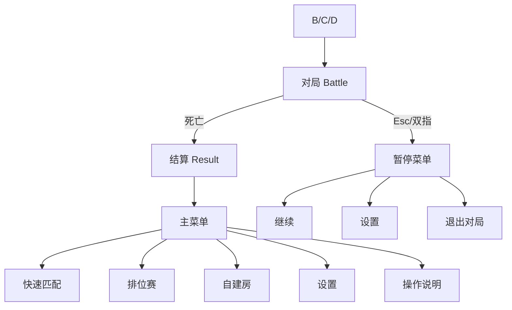

# NoitaCA 游戏内 UI / UX 交互设计文档

> **文档版本**：v1.0
> **创建日期**：2026-07-07
> **状态**：草稿 / 待评审
> **归属学科**：UX / 交互设计
> **维护人**：许清楚（产品经理）
> **配套文档**：本文档 §2「抽象输入集」与架构师高见远的《跨平台输入架构》互为**契约**（详见 §10）。其余约束对齐 `游戏设计文档.md` / `美术风格指南.md` / `多人联机帧同步对战设计.md` / `帧同步Netcode设计.md`。

---

## 1. 概述与目标

### 1.1 为什么需要这份文档

NoitaCA 是 Noita 风格**像素落沙元胞自动机**改造的 **2–8 人（默认 4 人乱斗）帧同步对战 / 大逃杀**（掉出竞技场边界即死亡，类百战天虫）。帧同步模型要求：**所有影响世界状态的操作，最终都必须收敛为同一套确定性输入**（30Hz `InputPayload`）。

但「确定性输入」与「人类可理解的操作」之间存在鸿沟：

```
玩家意图（移动/瞄准/施法）
   │
   ▼
[ 原始输入：键鼠 / 触屏 ]   ← 平台差异巨大（PC vs 手机）
   │
   ▼
[ 抽象输入集：动作词汇表 ]   ← ★ 本文明确定义，UX 与技术的契约
   │
   ▼
[ InputPayload（MoveX/Y, AimAngle, ActionFlags）]  ← 帧同步输入层（SpellId 已于 A4 删除，见 协议与序列化规范.md）
   │
   ▼
[ 锁步 + 玩家层回滚 ]        ← 帧同步Netcode设计 §3
```

本档目的：在**不破坏帧同步确定性**前提下，给出 PC 与移动端**并重**的交互方案，让两名玩家在两种设备上获得一致、可读、低门槛的操控体验。

### 1.2 设计原则

| 原则 | 含义 | 落地要求 |
|------|------|---------|
| **确定性优先** | 一切模拟内操作必须能映射成帧同步输入 | 任何「动作」若无法编码进 `InputPayload`，则不得影响世界状态；元操作（暂停、表情）不进确定性流 |
| **可读性** | 混乱场面也能读懂「接下来会发生什么」 | 沿用 GDD 反应表 + Telegraph 预告；HUD 状态色与材料语义一致 |
| **跨平台一致性** | PC 与移动端「能做的动作」完全一致 | 抽象输入集对两端通用；差异仅在于**采集方式**，不差异于**动作语义** |
| **低门槛高上限** | 移动+少量操作即可上手，材料组合带来深度 | 触屏默认双手模式，PC 默认键鼠；高级操作（切换法术、道具）可渐进学习 |

### 1.3 文档范围

- ✅ 覆盖：抽象输入集、PC 键鼠方案、移动端触屏方案、HUD、菜单/设置、屏幕自适应、无障碍、美术对齐、待架构师确认项。
- ❌ 不覆盖：像素模拟、网络协议细节、DOTS 实现（见对应架构文档）。
- ❌ 不修改任何既有文档，仅新增本文件。

---

## 2. 抽象输入集 / 动作词汇表（★最关键 · UX 与技术契约）

> **契约声明**：本节是 UX 与技术的唯一契约。架构师高见远在《跨平台输入架构》中**原样采用**下表动作名与语义；PC/移动端仅为不同采集通道，不得新增或删减动作语义。

### 2.1 动作词汇表

| 动作 ID（提案） | 中文名 | 语义 | 持续输入 | 进确定性流 | 建议映射（InputPayload） | 备注 |
|---|---|---|---|---|---|---|
| `Move` | 移动 | 2D 位移向量，范围 [−1,1]²（归一化） | **是** | **是** | `MoveX`, `MoveY`（int16 ×100，[−100,100]） | 键盘 8 向 / 摇杆连续；反作弊校验向量模长 ≤100 |
| `Aim` | 瞄准 | 施法 / 投掷方向角，[0,2π) | **是** | **是** | `AimAngle`（int16 ×100，[0,628]） | 鼠标 / 右摇杆计算**绝对角**后量化 |
| `CastSpell` | 释放当前法术 | 触发当前选中法术 | 否（按下边沿） | **是** | `ActionFlags.Attack（法术由 SelectedSpellSlot 推导）` | 边沿触发，非长按 |
| `SelectSpellNext` | 切换法术（下一槽） | 选中槽索引 +1（4 槽循环） | 否（边沿） | **是** | 待确认（见 §10.2）：新增 `ActionFlags.CycleNext` 或 `selectedSpellSlot` 状态 | 确定性自增 |
| `SelectSpellPrev` | 切换法术（上一槽） | 选中槽索引 −1（4 槽循环） | 否（边沿） | **是** | 同上 | 确定性自减 |
| `Jump` | 跳跃 | 基础位移，可被材料阻碍 | 否（边沿） | **是** | `ActionFlags.Jump` | GDD §6.1 |
| `Pickup` | 拾取 | 拾取地面道具 / 装备 | 否（边沿） | **是** | `ActionFlags.Pickup` | GDD §6.1 |
| `Drop` | 丢弃 | 丢弃当前持有道具 | 否（边沿） | **是** | `ActionFlags.Drop` | GDD §6.1 |
| `UseConsumable` | 使用消耗品 | 使用治疗/护盾/加速/炸弹 | 否（边沿） | **是** | 待确认（见 §10.2）：`ActionFlags.UseItem` 或复用 `Attack`（道具型） | 拾取后生效的消耗品 |
| Dash | 冲刺 / 闪避 | 短距位移 / 无 i-frames（ADR §3） | 否（边沿） | **是** | 待确认：ActionFlags.Dash | GDD §6.1 已列（bit9），见 ADR §3 |
| `PauseMenu` | 暂停 / 菜单 | 打开暂停菜单、退出对局确认 | 否 | **否（元操作）** | — | 不进模拟；仅客户端/UI 状态 |
| `QuickChat` | 快捷表情 / 短语 | 发送预设表情或短语 | 否 | **否（网络事件）** | `C2G_ChatMsg(QuickChat)` | 不影响模拟状态，走聊天通道（GDD §7.1） |

### 2.2 关键约束说明

- **持续输入 vs 边沿输入**：`Move`/`Aim` 每 30Hz tick 采样当前值；其余为「按下边沿」——输入层须在 tick 边界做**边沿检测**，将「本 tick 内发生过按下」转成对应 `ActionFlags` 位（见 §10.3）。
- **不进确定性流的两条**：`PauseMenu`（元操作）、`QuickChat`（网络事件，不影响世界状态）。它们**绝不**写入 `InputPayload`，避免污染锁步哈希。
- **与既有协议对齐**：上表 `Move/Aim/Jump/Pickup/Drop/CastSpell` 已直接对应 `InputPayload` 现有字段；`SelectSpell*`/`UseConsumable`/`Dash` 为待架构师在协议中落实的扩展（§10.2）。
- **动作数守恒**：无论 PC 还是移动端，同一套 12 个动作语义不变——平台只改变「如何产生这些动作值」。

### 2.3 输入流水线（Mermaid）



---

## 3. PC 端控制方案（键鼠）

### 3.1 键位映射表（默认）

| 动作 | 按键 | 类型 | 说明 |
|------|------|------|------|
| `Move` | `W A S D` 或 方向键 | 持续 | 8 向；斜向自动归一化（模长=100） |
| `Aim` | 鼠标移动 | 持续 | 玩家中心 → 光标向量 → 角度（见 §3.2） |
| `CastSpell` | 鼠标左键 | 边沿 | 释放当前选中法术 |
| `SelectSpellNext` | `Q` 或 鼠标滚轮上滚 | 边沿 | 下一法术槽 |
| `SelectSpellPrev` | `E` 或 鼠标滚轮下滚 | 边沿 | 上一法术槽 |
| `Jump` | `空格` | 边沿 | — |
| `Pickup` / `Drop` | `F` / `G` | 边沿 | 拾取 / 丢弃 |
| `UseConsumable` | `R` | 边沿 | 使用当前消耗品 |
| `Dash` | `Shift`（左） | 边沿 | 已确认保留（ActionFlags.Dash，ADR §3）|
| `PauseMenu` | `Esc` | 边沿 | 暂停菜单 |
| `QuickChat` | `1`–`6` / `Z X C V` | 边沿 | 快捷表情 / 短语（GDD §7.1） |
| 镜头 | 鼠标靠近屏幕边缘 / 中键拖拽 | 持续 | 待确认：是否手动镜头（见 §10.1 Q7） |

> 键位 100% 可在「设置 → 操作自定义」中重映射（§6、§8）。

### 3.2 鼠标瞄准 → 确定性方向

1. 客户端每渲染帧读取鼠标光标屏幕坐标，映射到世界坐标 `cursorWorld`。
2. 计算向量 `v = cursorWorld − playerWorld`，`angle = atan2(v.y, v.x)`。
3. **量化**：`AimAngle = round(angle / (2π) * 628)`，夹取 [0,628]。分辨率 ≈ 0.01 rad（≈0.57°），足够像素级精度。
4. 该 `AimAngle` 随 `InputPayload` 在 30Hz tick 上报——**所有客户端用同一 `AimAngle` 值模拟**，故无需跨端复算，天然确定性。

> 确定性要点：鼠标位置本身**不进**模拟；只有量化后的 `AimAngle` 进模拟。即使两端鼠标采样时刻不同，只要 `AimAngle` 值一致即一致（本地预测用本地值，回滚时以服务端权威 `InputPayload` 覆盖，见 帧同步Netcode设计 §3.3）。

### 3.3 PC 采集要点

- 键盘方向键与 `WASD` 二选一生效；斜向（如 `W+D`）输出 `(70,70)`→ 归一化 `(71,71)`（模长=100）。
- 左键施法为「点击边沿」；长按不连发（冷却由服务器校验，帧同步文档 §9.2）。
- 滚轮切法术：每次「刻度变化」算一次边沿（防滚动惯性连切）。

---

## 4. 移动端控制方案（触屏）

### 4.1 总体布局（双手模式 · 横屏）

```
┌────────────────────────────────────────────────────────────┐
│  [顶部 HUD]  🔥法术  ⚔击杀2  ⚠边界       [⏸暂停]   │
│                                                            │
│                      （竞技场画面）                         │
│                                                            │
│   ┌─ 左半屏 ─────────┐      ┌─ 右半屏 ───────────────┐    │
│   │                  │      │                        │    │
│   │     ⊙ 移动摇杆    │      │   触摸瞄准区（相对玩家）│    │
│   │   （左下锚定）     │      │        · 触点=方向      │    │
│   │                  │      │        ✸ 施法按钮(锚定) │    │
│   │ [◀切法术][切法术▶]│      │   [道具][冲刺]  (右上)  │    │
│   └──────────────────┘      └────────────────────────┘    │
│                                                            │
│              （底部安全区 ≈ 34pt 手势条）                  │
└────────────────────────────────────────────────────────────┘
```

### 4.2 控件与映射

| 控件 | 位置 | 对应动作 | 类型 | 说明 |
|------|------|---------|------|------|
| 虚拟摇杆 | 左下半屏（锚定，可拖出） | `Move` | 持续 | 摇杆偏移 → 归一化向量 [−100,100] |
| 瞄准触摸区 | 右半屏任意处 | `Aim` | 持续 | 触点相对**玩家屏幕位置**的向量 → 角度（同 §3.2 量化） |
| 施法按钮 | 右半屏锚定（建议右下） | `CastSpell` | 边沿 | 大圆按钮，直径 ≥ 64pt |
| 切法术 ◀ / ▶ | 左下方并排 | `SelectSpellPrev` / `Next` | 边沿 | 小按钮 ≥ 48pt |
| 道具按钮 | 右上区 | `UseConsumable` | 边沿 | 显示当前持有道具图标 |
| 冲刺按钮 | 右上区 | `Dash` | 边沿 | 已确认保留（ActionFlags.Dash，ADR §3）|
| 暂停按钮 | 顶部右角 | `PauseMenu` | 边沿 | 始终可见，避开刘海 |
| 快捷表情栏 | 顶部或右滑抽屉 | `QuickChat` | 边沿 | 6 个预设（GDD §7.1） |

### 4.3 手势（补充）

| 手势 | 动作 | 说明 |
|------|------|------|
| 双指轻点（两指同时落） | `PauseMenu` | 对局中快速暂停（防误触：需双指间隔 < 200ms） |
| 右半屏「上滑拖拽」 | `Aim` 微调 + `CastSpell` | 瞄准并施法一体化（进阶） |
| 长按道具按钮 | 查看道具说明 | 非模拟，纯 UI |

### 4.4 安全区与热区

- **安全区**：所有可点控件必须避开**刘海 / 挖孔**（顶部 ~44pt）与**底部手势条**（~34pt）。布局以 `Screen.safeArea` 为基准内缩。
- **最小热区**：可点击控件**实体尺寸 ≥ 44pt**（iOS HIG / Android 规范）；主要操作（摇杆、施法）建议 ≥ 64pt。
- **单手 vs 双手**：
  - **双手模式（默认）**：左摇杆 + 右瞄准/施法，如上图。覆盖全部 12 动作。
  - **单手模式（可选）**：仅左摇杆 + 自动瞄准（朝最近敌人/最近边界威胁）+ 施法按钮；切换法术/道具改为「轮询自动」或侧滑唤出。单手模式**降低上限、保底可玩**，适合通勤场景。默认关闭，设置中开启。

### 4.5 移动端采集要点

- 触屏为事件驱动；输入层在每 30Hz tick 读取「当前摇杆向量 / 当前瞄准触点」，构成 `MoveX/Y`、`AimAngle`。
- 边沿动作（施法/切法术/道具/冲刺）由 `pointerdown` 事件打标，tick 边界结算为 `ActionFlags`。
- 多点触控：摇杆（左拇指）与瞄准/施法（右拇指）**并行不互斥**，须支持 ≥2 个并发触控点。

---

## 5. HUD 设计

### 5.1 HUD 元素清单

| 元素 | 数据来源 | PC 位置 | 移动端位置 | 备注 |
|------|---------|---------|-----------|------|
| 生命 HP | MVP 无（D4 纯出界即死，无血条；HP 仅可选 Mode B；GDD 无 HP 项）| 左上 | 顶部左 | 条状 + 数值；状态色按 ART 指南 |
| 材料量 / 持有物 | 当前法术 + 道具 | 左下 | 底部中 | 法术图标 4 槽 + 道具格 |
| 当前法术 | SelectedSpellSlot 推导（法术槽 loadout）| 左下（法术槽高亮） | 底部中（高亮当前槽） | 几何符号（火=三角…） |
| 击杀数 | 对局状态 | 顶部中 | 顶部中 | 文本 |
| 边界警示 | 玩家距边界距离 | 屏幕边缘红光脉动 | 同左（更紧凑） | Kill 模式核心提示 |
| 小地图 | 待确认（见 §10.1 Q1） | 右上角 | 可收起（双指捏合） | 256×256 小场地建议用「边界雷达」替代 |
| 暂停 / 表情入口 | UI | 右上 | 顶部右角 | 避开安全区 |

### 5.2 PC HUD 分区草图

```
┌──────────────────────────────────────────────────────┐
│ ⚔2      [⏸]              [🗺小地图/雷达]      │  ← 顶部条
│                                                        │
│                     （竞技场画面）                      │
│   ⚠左边界红光 ┊                              ┊ 右边界红光 │  ← 边界警示
│                                                        │
│ ┌──────────────────────┐                              │
│ │ 🔥火 ▢ ▢ ▢  [🧪道具]   │  ← 底部：法术槽(高亮当前)+道具 │
│ └──────────────────────┘                              │
└──────────────────────────────────────────────────────┘
```

### 5.3 移动端 HUD 分区草图（更紧凑、可收起）

```
┌────────────────────────────────────┐
│⚔2  [⏸]                      │  ← 顶部仅关键信息
│                                     │
│         （竞技场画面）               │
│   ⚠边界红光（贴边脉动）              │
│                                     │
│   [🔥][▢][▢][▢] [🧪]   ← 底部法术/道具，可单指收起 │
└────────────────────────────────────┘
```

### 5.4 HUD 规则

- **可收起**：移动端战斗激烈时可一键隐藏非必要 HUD（仅留 边界警示 + 击杀数，无 HP），松手恢复。
- **状态色一致**：危险=火橙 `0xF900`、安全=冰青 `0x73FF`、禁用=暗灰 `0x514A`（ART 指南 §7）。
- **确定性**：HUD 仅做**表现**，不引入随机；状态过渡用整数帧插值（无血条）（禁用 `Time.deltaTime`，ART 指南 §2.3）。

---

## 6. 菜单与设置

### 6.1 菜单层级（Mermaid）



### 6.2 各菜单内容

| 菜单 | PC / 移动端一致性 | 关键内容 |
|------|------------------|---------|
| **主菜单** | 完全一致 | 模式入口、设置、操作说明；PC 用鼠标，移动端用大按钮（≥44pt） |
| **暂停菜单**（对局内） | 一致 | 继续 / 设置 / 退出对局确认；不暂停模拟（仅本地视图，服务器继续锁步） |
| **设置** | 一致，布局自适应 | 画质、音量、操作自定义、视角灵敏度 |
| **操作说明页** | 一致 | 按平台显示对应键位/手势图（PC 键位图 / 移动端布局图） |

### 6.3 设置项

| 设置 | 范围 | 备注 |
|------|------|------|
| 画质 | 低/中/高（像素游戏影响小） | 主要影响 URP 2D 后处理档位 |
| 音量 | 0–100% | 音乐 / 音效分轨 |
| 操作自定义 | 键位重映射（PC）/ 控件位置微调（移动） | 持久化；不影响确定性语义 |
| 视角灵敏度 | 0.5×–2.0× | 待确认：是否手动镜头（§10.1 Q7） |

---

## 7. 屏幕自适应

### 7.1 策略总览

| 维度 | 规则 |
|------|------|
| **横竖屏** | **锁定横屏**（Landscape）。竞技场为宽幅像素世界，竖屏不可用；启动时强制旋转 |
| **分辨率** | 锚定式 UI（Anchor），按 16:9 / 18:9 / 20:9 自适应缩放；PC 按窗口尺寸流式布局 |
| **安全区** | 所有 UI 以 `Screen.safeArea` 内缩，避开刘海/手势条（移动端） |
| **最小热区** | 移动端可点控件 **≥ 44pt**；主操作 ≥ 64pt |
| **大屏(PC) vs 小屏(手机)** | 同套 HUD 元素；PC 信息密度高（小地图常显），移动端默认收起非必要项 |

### 7.2 布局伸缩规则

```
PC（宽屏，信息全开）：
  顶部条 + 底部法术栏 + 右上小地图/雷达   ← 元素多，间距宽

手机（窄屏，信息精简）：
  顶部仅 击杀/边界警示/暂停（无 HP）+ 底部法术栏        ← 元素少，控件大
  小地图默认收起，双指捏合唤出
```

- **缩放基准**：以 720p（手机）与 1080p（PC）为两档设计基准，UI 用相对单位（dp/pt）而非像素。
- **极端比例**：超宽屏（21:9）两侧留像素边；折叠屏展开时按横屏重排。

---

## 8. 无障碍（Accessibility）

| 需求 | 方案 | 备注 |
|------|------|------|
| **色盲模式** | 状态色不单纯依赖色相：危险=火橙+闪烁/描边；安全=冰青+实心；禁用=暗灰+斜纹。提供「色盲安全」配色切换 | 受 RGB565 限制：色盲安全色须仍在 16 位板内（见 §9）；禁用依赖红绿区分 |
| **可放大热区** | 设置中「控件放大」1.0×–1.5×；最低仍 ≥44pt | 移动端专属 |
| **键位重映射** | PC 全动作可改键；移动端控件位置可拖拽保存 | 不影响动作语义（§2 契约） |
| **高对比** | 提供「高对比 UI」开关，强化描边与底色差 | 像素风格天然高对比 |
| **减少动效** | 关闭非必要 Telegraph 之外的动效（仍保留公平预告） | 防光敏；ART 指南 §2 已禁用随机动效 |

---

## 9. 与美术风格指南的对齐

> 引用 `美术风格指南.md`（强约束）。UI 是「像素落沙确定性渲染」的一部分，**必须服从**以下约束：

| ART 指南约束 | UI 落实方式 |
|-------------|------------|
| **RGB565 16 位色域**（R5G6B5） | 所有 UI 颜色（状态色、按钮）必须从 §3 调色板取 16 位值；**禁止引入板外色**。色盲安全替代色也须可编码进 `ushort` |
| **禁用后处理随机 / 每帧随机抖色** | UI 过渡、血条变化、Telegraph 用**整数帧驱动**动画（基于帧计数，非 `Time.deltaTime`） |
| **禁用浮点后处理调色（bloom 等）** | UI 不依赖 HDR/32 位；特效走预定义 16 位调色板 |
| **像素字体** | 中文用点阵像素中文字体；英文用像素字体 |
| **状态色语义** | 危险=火橙 `0xF900`、安全=冰青 `0x73FF`、禁用=暗灰 `0x514A`（与材料语义一致） |
| **图标风格** | 法术图标（火=三角、冰=六边形、毒=水滴）单色+描边；道具扁平 1–2 色（ART §6） |
| **资源版本对齐** | UI prefab / 图标进 YooAsset，对局前版本校验（帧同步文档 §4.5.3），避免视觉 desync |

**确定性红线**：任何 UI 动画若依赖 `Time.deltaTime` 或随机抖色 → **破坏帧同步确定性**，一律禁止。

---

## 10. 待架构师确认事项（高见远 · 《跨平台输入架构》）

> **本节为双向契约锚点**：§2「抽象输入集」是 UX 与技术的唯一动作契约，架构师须**原样采用**；下方为需架构师在输入层落实的技术点。

### 10.1 玩法 / 设计待确认（影响动作集）

| # | 问题 | 现状 | 待确认方向 |
|---|------|------|-----------|
| Q1 | 是否需**小地图**？ | ART 指南 §7 提及，但 256×256 小场地未必需要 | 建议用「边界雷达 / 威胁指示」替代；确认是否保留小地图 |
| Q2 | 是否有**缩圈**机制？ | GDD 无；边界固定 Kill/Bounce/Wrap | 确认无缩圈（HUD 不设计缩圈圈） |
| Q3 | 冲刺/闪避 Dash 是否存在？ | GDD §6.1 已列 Dash（见 ADR §3）；Dash 保留 | 若加入，需 `ActionFlags.Dash`；否则从动作集移除 |
| Q4 | **HP 死亡语义**？ | GDD Q1 开放：环境伤害是否第二死因 | 确认 HP=0 是否致死，影响 HUD 血条必要性；当前 ADR D4 默认无 HP，血条仅 Mode B 可选；MVP HUD 不画血条 |
| Q5 | **抛物线法术的力度（power）**如何输入？ | `InputPayload` 仅有 `AimAngle`，无力度字段 | 建议固定力度 / 或新增持续输入 `AimPower`（待定） |
| Q6 | **法术切换模型**：循环选择 vs 直选槽？ | 既有协议有 `Spell1/Spell2` 直选标志 | 确认采用「循环切换+单施法」(移动友好) 还是「多槽直选」 |
| Q7 | 是否支持**手动镜头**控制？ | GDD 未提；疑似自动跟随 | 确认镜头策略，影响「视角灵敏度」设置项存废 |

### 10.2 协议 / 输入层待落实

| # | 技术点 | 说明 |
|---|--------|------|
| T1 | **抽象输入层接口** | 定义 `IPlayerInputProvider` / `InputFrame`：统一产出 `InputPayload`（MoveX/Y, AimAngle, ActionFlags）。PC/移动两个 Provider 实现同一接口 |
| T2 | **离散动作边沿检测** | 30Hz tick 边界将「本 tick 内按下」转 `ActionFlags` 位；长按不连发。须架构师在采集层实现 |
| T3 | **采样率对齐** | 输入采集在 30Hz tick 进行（与 tick rate 一致）；触屏事件经边沿缓存到下一 tick |
| T4 | **`SelectSpell*` / `UseConsumable` / `Dash` 协议扩展** | 若 Q3/Q6 确认保留，需在 `ActionFlags` 增位或新增 `selectedSpellSlot` 状态字段 |
| T5 | **输入预测兼容** | 本地输入立即应用（零延迟），远端用上一帧乐观填充；`INPUT_DELAY=2, MAX_ROLLBACK=7`（FRAME_SYNC §3）。采集层须配合回滚快照 |
| T6 | **`AimAngle` 量化精度** | 确认 [0,628] 范围与 0.01 rad 分辨率满足像素级命中；跨端一致 |
| T7 | **`MoveX/Y` 归一化与反作弊** | 向量模长 ≤100 校验（帧同步 §9.2）；键盘/摇杆归一化方式须一致 |
| T8 | **键位重映射持久化** | 重映射数据存本地（MemoryPack），不影响确定性语义；跨端不共享 |

### 10.3 契约确认回执

- ✅ **UX 侧承诺**：§2 动作集为最终语义契约，PC/移动端不增减动作。
- ⏳ **架构侧待办**：落实 T1–T8，并答复 Q1–Q7；答复后本文档更新版本号与状态。

---

**文档结束**
