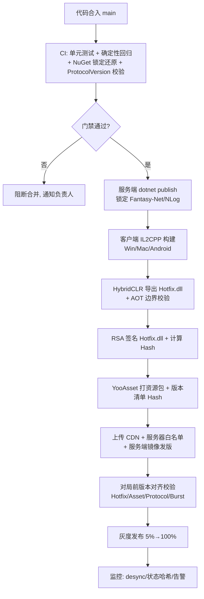
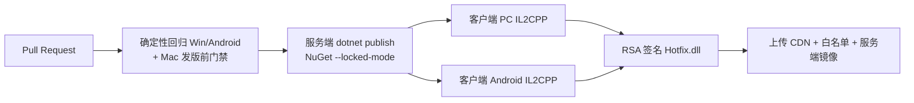

# NoitaCA 构建与部署 / CI 文档（Build & Deploy）

> **文档版本**：v1.1（在 v1.0 草稿基础上深化；保留既有结构与章节标题，补充 HybridCLR 热更边界、CI/CD 确定性构建、协议版本 1→2 策略、灰度压测、监控告警）
> **创建日期**：2026-07-06
> **更新日期**：2026-07-07
> **状态**：评审中（深化版）
> **归属学科**：技术 / 生产（Build & Release）
> **维护人**：构建 / 发布工程师（devopsengineer）
> **架构约束评审**：高见远（架构师）
> **对齐**：
> - 热更 / 签名 / 版本对齐 / 灰度机制来自 `多人联机帧同步对战设计.md §4.3 / §4.5 / §9.3`；
> - Burst 锁定来自 GAMEPLAY §12.2；
> - 协议版本策略以 `协议与序列化规范.md`（ProtocolVersion 当前=2，因删除 SpellId 由 1→2 bump）为单一事实源；
> - NuGet 锁定以 `架构决策记录.md §6 A3`（Fantasy-Net 2025.2.1402 / NLog 5.5.1）为硬约束；
> - 监控告警引用 QA `设计审查_2026-07-07.md` 的 **B3（确定性 CI 卡点）** 与 **B5（AimPower 后期追加需协议 version bump）**。
>
> 本文将其收敛为独立的构建 / 发布 / 回滚流程。

> **本流程由构建 / 发布工程师维护，架构约束由高见远（架构师）评审。**

---

## 1. 构建目标矩阵

| 平台 | 后端 | 产物 | 说明 |
|------|------|------|------|
| Windows (PC) | IL2CPP | `.exe` + 数据目录 | 直接 Build，CI 主构建机 |
| Mac | IL2CPP | `.app` | 需 Mac 机 / 云构建（CI 矩阵远端） |
| Android | IL2CPP | `.apk` / `.aab` | 中端机性能阈值见 测试QA计划 §4 |

**构建机要求（客户端）**：
- Unity **6000.3.19f1**（与项目一致，ADR §6 A2 已修）
- Burst **锁定 1.8.29**（跨版本破坏确定性，§6）
- HybridCLR **8.12.0**
- RSA **私钥仅构建机持有**（用于 Hotfix.dll 签名，§3.4）

**构建机要求（服务端，.NET 8）**：
- .NET 8 SDK（与 `Server/*.csproj` 的 `TargetFramework` 一致）
- NuGet **完全锁定，禁止 `*` 漂移**（ADR §6 A3）：
  - `Fantasy-Net` **2025.2.1402**
  - `NLog` **5.5.1**
  - 其余依赖同样需在 `Server/*.csproj` 写死具体版本，并提交 `packages.lock.json`（`RestorePackagesWithLockFile=true`），CI 以 `--locked-mode` 还原，**任何版本漂移直接失败**。
- 构建出的 `Server` 程序集（Main / Entity / Hotfix 三层，见 §3.1）通过 `dotnet publish` 产出自包含/框架依赖镜像。

> **构建矩阵（PC / Android）**：CI 至少跑 **PC(IL2CPP) + Android(IL2CPP)** 两条；Mac 因云构建成本纳入"发版前"门禁而非每 PR。客户端三平台产物均需通过 §8 的确定性 + 版本一致性门禁。

---

## 2. 构建流程总览



> 与原 v1.0 相比：在 CI 门禁显式加入 **NuGet 锁定还原** 与 **ProtocolVersion 一致性校验**（§7.2），并把"服务端构建"与"客户端构建"并列；末尾接入 §10 监控闭环。

---

## 3. HybridCLR 热更架构

对齐架构文档 §4.3 / §4.5 / §9.3。核心矛盾：**对局中不能热更（会 desync），但全局热更能力必须保留**。

### 3.1 Hotfix.asmdef 与 AOT 边界（关键）

项目分两层，热更边界由程序集（asmdef）硬性隔离：

| 程序集 | 归属 | 可否热更 | 内容 |
|--------|------|----------|------|
| **AOT 层（不可热更）** | `NoitaCA.Core` / `NoitaCA.Lockstep` / `NoitaCA.Simulation` + 客户端 AOT 壳 + 服务端 Entity/Main | ❌ | 确定性模拟（DOTS ECS Job）、`DeterministicInput`↔`InputPayload` 零拷贝映射、MemoryPack 序列化、状态哈希、输入验证、场景事件调度器、反作弊执行器 `AntiCheatSystem` |
| **Hotfix 层（可热更）** | `Hotfix.asmdef`（客户端）/ `Hotfix.csproj`（服务端） | ✅ | 协议消息 handler、UI 逻辑、匹配/房间请求转发、反作弊**参数**（阈值/冷却数值，`AntiCheatConfig`）、场景事件时间线配置（道具刷新表/Telegraph 帧数）、`MatchConfig`/`RoomConfig` 等数据对象 |

**边界铁律（来自 协议与序列化规范 §3.2）**：
- AOT **绝不能反向依赖** Hotfix；Hotfix 引用 AOT。
- 凡进入 `InputPayload` / 参与锁步状态哈希的逻辑（模拟、`NoitaCA.Lockstep`、序列化适配）**全部在 AOT，绝不在 Hotfix**。
- 协议处理 handler 在 Hotfix，但 handler 调用的确定性模拟入口在 AOT —— 热更只能改"如何响应消息/如何配置规则"，不能改"模拟本身如何算"，否则同版本客户端之间会 desync。
- **CI 静态校验**（见 §8）：扫描 Hotfix 程序集，禁止引用 `NoitaCA.Simulation` 内部确定性类型做逻辑分支；AOT 程序集禁止出现对 Hotfix 的反向 `using`。

### 3.2 可热更 / 不可热更清单

**可热更（Hotfix）**：协议 handler、UI、匹配/房间转发、反作弊参数、时间线/配置表、数据对象。**热更时机约束**：仅大厅 / 房间 Lobby / 结算状态可热更；**对局 Battle 状态与 Lobby→Battle 加载过渡期绝对禁止热更**（架构 §4.5.2）。

**不可热更（AOT，须发新客户端/服务端版本）**：
- 任何确定性模拟逻辑、Burst Job、`Fix64`/`Xorshift128Plus`/`MurmurHash3` 实现；
- `ProtocolVersion` 的 wire 语义变更（增删字段属破坏性变更，须 bump，见 §7）；
- Burst 版本变更（见 §6）；
- HybridCLR 运行时本身、AOT 元数据类型布局。

### 3.3 热更包构建（HybridCLR 导出 Hotfix.dll）

1. CI 在 IL2CPP 全量构建后，用 HybridCLR `HybridCLR.Editor` 对 `Hotfix.asmdef` 产出 **`Hotfix.dll`**（含 AOT 补充元数据若启用）。
2. **AOT 边界二次校验**：构建脚本比对 `Hotfix.dll` 引用的类型集合，确认未触碰 AOT 确定性类型（失败即阻断，防止热更引入 desync 隐患）。
3. 计算 `H = SHA256(Hotfix.dll)`。
4. 用构建机 **RSA-2048 / ECDSA-P256 私钥** 对 H 签名 → `signature`。
5. 公钥 `pubKey` 内置 AOT（客户端运行时验签）；服务端持有预共享公钥（白名单校验用）。

### 3.4 打包与签名（详细）

- 构建机导出 `Hotfix.dll` → 计算 `H = SHA256(Hotfix.dll)` → 私钥签名得 `signature`。
- 产物附带 `HotfixHash`、`HotfixSignature`、`HotfixVersion` 三元组，写入 YooAsset 资源包的元数据与版本清单。
- **RSA 私钥仅构建机持有**；构建机与生产服务器网络隔离，私钥不进代码仓库、不进镜像层（用构建机 KMS / Secret Manager 注入）。

### 3.5 验签链路

```
客户端启动: AOT 内置 pubKey 验本地 Hotfix.dll 的 (H, signature)
客户端连接: 上报 (H, signature) 给服务器
服务器: 用预共享公钥验签 + 比对 H 是否在白名单
        失败 / 不在白名单 → 拒绝连接
```

### 3.6 防重放

- 服务器对 `(RoomId, PlayerId, H)` 记录会话标记，同元组每连接仅上报一次。
- 断线重连视为新会话，旧标记在 socket close 时清除（架构 §9.3）。

### 3.7 热更时机约束（对局中禁热更）

- ✅ 大厅状态：可热更
- ✅ 房间 Lobby 状态：可热更（房主可强制等待所有人热更完成）
- ✅ 结算状态：可热更
- ❌ **对局 Battle 状态：绝对禁止热更**（替换 Hotfix.dll 会导致旧 handler 不生效、静态字段丢失、4 客户端时序不一致 → desync）
- ❌ 对局加载过渡期：禁止热更

**对局中热更策略**：服务器在对局开始时锁定 `HotfixVersion`；对局中即使客户端拉到新版本也**不应用**，等对局结束；对局结束后强制走热更流程，再进下一局。

### 3.8 热更回滚策略（详细）

热更（Hotfix / 资源）可灰度回退；**AOT / Burst / ProtocolVersion 变更不可热更，须发新客户端版本**。

| 场景 | 回滚动作 | 时效 |
|------|----------|------|
| 新 Hotfix 致命 bug | 从白名单移出该 `HotfixHash` → 客户端回退到上一稳定版本（旧包仍在 CDN 且未删） | 分钟级 |
| 新资源包逻辑错误（如 Telegraph 帧数/道具表错） | 回退 `AssetManifestHash` 到上一稳定清单；旧清单 CDN 保留 | 分钟级 |
| Hotfix 与资源需联合回退 | 同时回退 `HotfixHash` + `AssetManifestHash`，保持二者组合在白名单为"已验证稳定对" | 分钟级 |
| 签名密钥泄露 | 轮换 RSA 密钥 + 全量客户端发版（极端情况，旧包所有签名失效） | 小时级 |

> **回滚前提**：CDN 必须**保留最近 N 个历史版本包**（不覆盖、不立即清理），回滚仅是"改白名单指向"，无需重新上传。详见 §11。

---

## 4. YooAsset 资源版本清单

对齐架构文档 §4.5.3 / §4.5.4：

- 资源分类：UI prefab / 特效 / 音效 / 场景预制体 / 道具 prefab / 配置表 / Telegraph 特效 / Texture。
- **影响逻辑或玩法表现**的资源（特效、地形、道具、配置表）必须**全房版本一致**，否则服务器拒进对局。
- 构建时生成 `AssetManifestHash`（YooAsset 版本清单哈希），随客户端上报。
- 资源预加载：Lobby→Battle 过渡（约 3s）按 `ItemSpawnTable` 预加载本局可能用到的 prefab；Telegraph 期间（3s）异步加载；未完成用纯色占位 prefab，不影响逻辑（拾取判定走服务器）。

---

## 5. 版本对齐校验（对局前）

对齐架构文档 §4.5.4 / §4.5.5：

```csharp
public struct ClientVersionReport
{
    public string HotfixHash;          // SHA256(Hotfix.dll)
    public string HotfixSignature;     // 构建机私钥签名
    public string AssetManifestHash;   // YooAsset 版本清单哈希
    public uint ProtocolVersion;       // 协议版本号（当前=2，见 §7）
    public uint BurstVersion;          // Burst 编译器版本
}
```

**服务器校验规则（房主点"开始"时，进入 Battle 前）**：

| 校验项 | 规则 | 不一致处置 |
|--------|------|-----------|
| `HotfixHash` | 在白名单（允许多版本兼容组） | 拒绝，提示"版本不一致" |
| `AssetManifestHash` | 房间内所有玩家全一致 | 拒绝开始 |
| `ProtocolVersion` | 匹配当前服务器版本（期望值常量=2，ADR §8 行动项 6） | 拒绝连接 |
| `BurstVersion` | 全一致（跨版本破坏确定性） | 拒绝开始 |

> 校验失败统一触发服务端告警（§10），用于区分"正常灰度分流"与"异常版本错配"。

---

## 6. Burst 版本锁定

- 锁定 **Burst 1.8.29**（GAMEPLAY §12.2 / 风险登记）。
- CI 比对构建产物的 `BurstVersion` 字段与服务器期望值。
- 升级 Burst 须先全量确定性回归（§8）+ 全量客户端强制更新（灰度不可跨 Burst 版本）。
- Burst 变更属 **AOT 层不可热更**，必须随新客户端版本发布。

---

## 7. 协议版本策略（ProtocolVersion 1→2）与灰度发布

对齐 `协议与序列化规范.md §7` 与 ADR §6 A4/A5。

### 7.1 现状：ProtocolVersion = 2

- **基线 1**：含 `uint32 SpellId`（12 字节 `InputPayload`）。
- **当前 2**：删除 `SpellId`（8 字节 `InputPayload`，−33% 带宽），bit2/3 与 bit10–15 为保留位（当前禁用，不 bump）。
- 因删除 `SpellId` 属**破坏性 schema 变更**，必须 bump 1→2 并同步客户端/服务端版本校验。

### 7.2 1→2 bump 流程（破坏性变更标准动作）

1. **改 proto**（`Tools/NetworkProtocol/Outer/OuterMessage.proto`）：删除 `InputPayload.SpellId`，跑 `ProtocolExportTool` 重新生成服务端/客户端代码（禁手改 Generate）。
2. **CI 校验**（§8 门禁）：
   - 检测 MemoryPack 消息字段号冲突 / 破坏式 schema 变更 → 阻断；
   - 确认 `ProtocolVersion` 常量已自增（客户端 `ClientVersionReport.ProtocolVersion` 与服务器"期望 ProtocolVersion"常量同步，ADR §8 行动项 6 云澈钩子）。
3. **双端发版协同**：
   - 服务端先上（仍兼容读旧 wire？否——MemoryPack 不允许删字段后读旧包，故服务端"期望值"直接置 2）；
   - 客户端发版并 bump `ProtocolVersion=2`；
   - **过渡期**：服务端白名单临时同时接受 1 与 2 的 `ProtocolVersion`（兼容组），但**仅同版本互匹配**（§7.4）；旧版本客户端只与旧版本互打，自然随灰度收敛到 2。
4. **全量后**：移出 ProtocolVersion=1 兼容组，旧客户端连接即被 `ProtocolVersion` 校验拒绝（提示"请更新客户端"），不进入对局、不 desync、不崩溃。

> **向后兼容原则**：新增字段（追加）+ bump 是可接受的；**删除/改类型/改字段号**必须 bump 且旧客户端拒绝。bit2/3、bit10–15 保留位禁用**不** bump（向后兼容），但 `ValidateInput` 必须拒绝置位（协议与序列化规范 §8）。

### 7.3 旧客户端处理

- **已上线旧客户端（ProtocolVersion=1）**：服务端的 `ProtocolVersion` 校验在连接/重连时即拒绝，给出"版本过低，请更新"提示；**不参与对局**，避免 wire 不兼容导致的 desync 或崩溃。
- **灰度过渡期**：旧客户端仍可与同版本旧客户端匹配（兼容组），但匹配池被隔离，随灰度比例收敛自然淘汰。
- **未上线项目（当前状态）**：所有上游文档为"待评审/未发布"，无任何已上线客户端需迁移（协议与序列化规范 §4.3），故 1→2 当前可直接落地，无需停机迁移。
- **监控关注**：bump 后监控旧版本拒绝率曲线（§10），确认无异常尖峰（异常尖峰可能意味着客户端分发/CDN 故障，而非正常淘汰）。

### 7.4 灰度发布策略

```
版本号格式: <ProtocolVersion>.<HotfixVersion>.<AssetVersion>  例: 2.0.3  （注：ProtocolVersion 当前=2）

灰度策略:
  1. 新 Hotfix.dll + 资源包上传 YooAsset CDN
  2. 服务器白名单加入新版本哈希（标记"灰度"）
  3. 匹配优先同版本（白名单组内匹配）
  4. 灰度比例 5% → 20% → 50% → 100%
  5. 全量后旧版本移出白名单，强制热更
```

- 灰度的前提是 `BurstVersion` / `ProtocolVersion` 一致（否则不可同组）。
- 灰度期匹配池分裂风险：动态调整比例 + 跨版本兼容组（架构 §13 风险）。
- **触发灰度回滚的条件**（见 §9 / §11）：灰度桶内 desync 率、状态哈希失配率、崩溃率、关键告警任一越阈值。

### 7.5 灰度回滚（与 §3.8 / §11 协同）

- 灰度比例每升一档前，需确认上一档监控指标平稳（§10 阈值）。
- 回滚动作 = 将白名单"灰度"标记回退到上一稳定 `HotfixHash` + `AssetManifestHash` 组合，历史包仍在 CDN。
- 若回滚涉及 `ProtocolVersion`/`BurstVersion` 变更（AOT 层），**无法热更回滚**，必须发新客户端版本并走 App Store / CDN 全量分发。

---

## 8. CI/CD 确定性构建

> 对应 QA **B3（确定性 CI 卡点未确认落地）**：本节把"10000 帧三平台状态哈希一致 + GC=0"固化为 **CI 强制门禁**，并加入 NuGet 锁定还原与 ProtocolVersion 一致性校验。

### 8.1 确定性构建门禁（最高优先级，失败即阻断合并）

| 阶段 | 校验 | 工具 / 方式 | 失败处置 |
|------|------|------------|----------|
| 单元 | Fix64 / Xorshift128Plus / MurmurHash3 / 材料反应表 / ArenaConfig / 道具刷新表 | NUnit（Editor） | 阻断 |
| 确定性回归 | **相同输入，Win / Mac / Android 跑 10000 帧，状态哈希完全相同**；多线程=单线程哈希一致；奇偶帧迭代一致 | 脚本化输入（无随机、无 `Time.deltaTime`），逐 60 帧输出哈希 diff | **阻断（最高优先级）** |
| 性能门禁 | 热路径 GC = 0 字节/帧；单帧逻辑 <16ms(Win)/<25ms(Android) | Profiler / GC Alloc 断言 | 阻断 |
| Burst 锁 | `BurstVersion` == 1.8.29 | CI 比对产物字段 | 阻断 |
| NuGet 锁（A3） | `dotnet restore --locked-mode`：Fantasy-Net 2025.2.1402 / NLog 5.5.1 / 其余依赖版本与 `packages.lock.json` 完全一致 | `dotnet restore --locked-mode`（Server） | **阻断（版本漂移即失败）** |
| 协议一致性 | MemoryPack 消息无字段号冲突、无破坏式 schema 变更；`ProtocolVersion` 常量与 proto 一致 | ProtocolExportTool + 静态校验 | 阻断 |
| AOT/Hotfix 边界 | Hotfix 未触碰 AOT 确定性类型；AOT 不反向依赖 Hotfix | asmdef 依赖图扫描 | 阻断 |

### 8.2 NuGet 锁定落地（ADR A3）

- `Server/*.csproj`：所有 `PackageReference` 写死具体版本（含 `Fantasy-Net 2025.2.1402`、`NLog 5.5.1`）。
- 启用 `<RestorePackagesWithLockFile>true</RestorePackagesWithLockFile>`，提交 `packages.lock.json`。
- CI 步骤：`dotnet restore --locked-mode`；任何 `*` 或锁定文件漂移 → 还原失败 → 阻断。
- 升级依赖须走 PR + 评审，更新锁定文件并重新生成，禁止"悄悄漂移"。

### 8.3 协议版本兼容校验（CI 侧）

- 每次 proto 变更后跑 `ProtocolExportTool`，CI 比对：
  - 服务端生成目录 `Server/Entity/Generate/NetworkProtocol/` 与客户端 `Client/Assets/Scripts/Hotfix/Generate/NetworkProtocol/` 的 `ProtocolVersion` 常量一致；
  - 若检测到 MemoryPack 消息**删除字段/改类型/改字段号** → 强制要求 `ProtocolVersion` 自增，否则阻断（落实 §7.2）。
- 服务端"期望 ProtocolVersion"常量（当前=2）由 CI 注入配置，与客户端上报值同源。

### 8.4 构建矩阵（PC / Android，含 Mac 发版门禁）



- **每 PR**：PC(IL2CPP) + Android(IL2CPP) + 服务端锁定还原 + 确定性回归（Mac 纳入发版前而非每 PR，降低云构建成本）。
- **发版前（Release Gate）**：补跑 Mac(IL2CPP)，三平台产物 + 服务端镜像一并过 §12 清单。

---

## 9. 压测：帧同步 server 并发要点

> 服务端（.NET 8 + Fantasy-Net 2025.2.1402）**不跑像素模拟**，只做：输入聚合(30Hz)、输入验证、场景事件注入、状态哈希比对(0.5Hz)、重连快照分片。压测聚焦这些中继路径的并发上限。

### 9.1 并发模型与瓶颈点

| 维度 | 说明 | 瓶颈点 |
|------|------|--------|
| 并发房间数 × 玩家数 | N=2/4/8（默认 4，上限 8） | 每房间 30Hz 输入聚合 + 每 60 帧状态哈希多数派裁决的 CPU |
| 输入聚合（30Hz） | 每 33ms 收集全房间 `C2G_Input` → 打包 `G2C_FrameBatch` | 单房间 30 次/秒转发；N=8 上行最坏 15KB/s（§13 风险） |
| 输入验证 `ValidateInput` | 每帧每玩家执行（移动/瞄准/保留位/位移幅度） | 纯 CPU，Burst 不在服务端；需关注热点 |
| 状态哈希裁决 | 每 60 帧（2s）收集 4–8 客户端哈希，多数派投票 | 环形缓冲 `PlayerStateHash`(60)，连续 3 次少数派踢出 |
| 重连快照 `G2C_SnapshotChunk` | 16KB 大块 MemoryPack，分片下发 | 落后 >10 帧走全量快照；快照生成/下发吞吐 |
| 时钟同步 | 每 10s 一次小包 | 极低负载 |

### 9.2 压测方案

- **无头 bot 客户端**：用 headless 模式（不渲染）模拟 N 玩家 × M 房间，复用真实 `C2G_Input`/`C2G_StateHash` 序列化路径，避免渲染成为瓶颈。
- **目标容量**：单 server 节点先测「稳定无积压」的并发房间上限（建议起点：默认 4 人房 × 数百间；8 人房按带宽/CPU 折半估算），再按**真实峰值 × 1.5–2 冗余**规划节点数（留冗余，覆盖突发与单节点故障）。
- **指标**：P99 输入聚合延迟、帧批次下发延迟、状态哈希投票 CPU 占用、`ValidateInput` 耗时、重连快照吞吐、内存（每房间 `PlayerInputQueue`(30帧)+`PlayerStateHash`(60)）、网络带宽（N=8 上行 15KB/s、下行 `G2C_FrameBatch`）。
- **失败判定**：出现输入聚合积压、帧批次延迟超 `INPUT_DELAY`(2 帧=66ms) 容限、状态哈希裁决超时 → 触发扩容/限流（§10.4）。

### 9.3 限流与熔断（压测后落地）

- 单节点房间数 / 玩家数达容量上限 → 匹配层拒绝新建房间或引流到新节点（而非硬扛）。
- 单玩家输入频率超 30Hz（同帧/乱序）→ `ValidateInput` 已在协议层拒绝（协议与序列化规范 §8）；压测验证该拒绝在高并发下不漏。
- 状态哈希裁决异常率越阈值 → 触发 §10 告警，必要时熔断该房间对局并转入人工分析。

---

## 10. 监控告警：desync / 状态哈希异常

> 对应 QA **B3（确定性 CI 卡点）** 与 **B5（AimPower 后期追加需协议 version bump）**：B3 要求生产侧持续盯 desync；B5 要求协议变更（如未来加 `AimPower` 字段）走 bump 流程且旧客户端被干净拒绝、不 desync/崩溃。

### 10.1 核心监控指标

| 指标 | 来源 | 含义 |
|------|------|------|
| `desync_rate` | 服务端状态哈希裁决（每 60 帧） | 房间内出现少数派 / 失配的比例；应恒为 0 |
| `hash_mismatch_count` | `PlayerStateHashComponent.MismatchCount` | 单玩家连续失配次数（≥3 踢出） |
| `hash_mismatch_event` | `G2C_HashMismatch` 下发 + 服务端日志 | 每次失配事件，用于聚类分析 |
| `version_reject_rate` | `ClientVersionReport` 校验失败 | HotfixHash/AssetManifestHash/ProtocolVersion/BurstVersion 任一不匹配的拒绝率 |
| `hotfix_sig_fail_rate` | 验签失败 | 签名验证失败（潜在篡改/损坏），安全告警 |
| `reconnect_snapshot_fail` | 重连快照分片 ACK 失败 | 重连恢复一致性失败 |
| `ci_determinism_gate` | CI §8.1 | 确定性回归是否通过（B3 卡点健康度） |
| `protocol_version_reject` | ProtocolVersion 校验拒绝 | bump 后旧客户端淘汰曲线（B5 关注） |

### 10.2 告警分级

| 级别 | 触发条件 | 响应 |
|------|----------|------|
| **P0（致命）** | `desync_rate` > 0 持续；`hotfix_sig_fail_rate` 异常尖峰；`version_reject_rate` 异常尖峰（疑似 CDN/分发故障而非正常淘汰） | 立即电话/IM 通知 on-call；评估灰度回滚（§7.5 / §11） |
| **P1（严重）** | 单房间连续 3 次少数派踢出（标记对局异常，录像送人工）；`reconnect_snapshot_fail` 超阈值 | 工单 + 值班跟进；定位是否新 Hotfix/资源引入 |
| **P2（关注）** | `protocol_version_reject` 曲线异常（bump 后旧客户端未平滑收敛，或骤降骤升）；CI 确定性门禁抖动 | 日报跟踪；评审协议变更是否到位（B5） |
| **P3（信息）** | 正常灰度分流的版本不匹配（兼容组隔离，非异常） | 仅记录，不告警 |

### 10.3 看板建议

- 实时：`desync_rate`、`hash_mismatch_event/min`、`version_reject_rate`、`hotfix_sig_fail_rate`。
- 趋势：`protocol_version_reject` 按版本分布（观察 1→2 淘汰曲线）、灰度桶健康度。
- 关联：每次发版/灰度变更打点，便于告警与版本回滚联动。

### 10.4 与灰度/回滚联动

- 灰度每升一档前，确认 §10.2 P0/P1 指标平稳；任意越阈值 → 暂停灰度并回退白名单（§7.5 / §11）。
- 压测（§9）发现的容量上限，作为限流阈值输入；超阈值触发扩容而非硬扛。

---

## 11. CDN 与回滚

| 场景 | 措施 |
|------|------|
| 新版本致命 bug | 从白名单移出该 `HotfixHash`，回退到上一稳定版本（旧包仍在 CDN） |
| YooAsset CDN 故障 | 本地缓存兜底 + 重试 + 对局前资源完整性校验（架构 §13 风险） |
| 资源版本不对齐 | 大厅 YooAsset 热更对齐后再进对局，禁止带不一致资源进 Battle |
| 构建机私钥泄露 | 轮换 RSA 密钥 + 全量客户端发版（极端情况） |
| 历史包保留策略 | CDN 保留最近 N 个历史版本包（不覆盖、延迟清理），回滚=改白名单指向，无需重传 |
| ProtocolVersion/Burst 变更回滚 | 属 AOT 层，不可热更；须发新客户端版本并全量分发（§7.5） |

> **回滚原则**：热更（Hotfix / 资源）可灰度回退；**AOT / Burst / ProtocolVersion 变更不可热更，须发新客户端版本**。

---

## 12. 发布检查清单（Release Checklist）

- [ ] 客户端三平台 IL2CPP 构建成功（PC / Android 每 PR；Mac 发版前）
- [ ] 服务端 `dotnet restore --locked-mode` 通过：Fantasy-Net 2025.2.1402 / NLog 5.5.1 锁定（A3）
- [ ] Burst 版本 = 1.8.29（锁定）
- [ ] Hotfix.dll 已 RSA 签名，Hash 入白名单
- [ ] YooAsset 资源包 + AssetManifestHash 生成
- [ ] `ProtocolVersion`（当前=2）与服务端期望值一致；MemoryPack 无破坏式 schema 变更
- [ ] CI 确定性回归通过：Win/Mac/Android 10000 帧状态哈希一致 + GC=0（B3 卡点）
- [ ] AOT/Hotfix 边界静态校验通过
- [ ] 灰度比例按 5%→100% 推进，每档确认 §10 监控平稳
- [ ] 压测报告归档：并发房间上限 + 冗余规划 + 限流阈值（§9）
- [ ] CDN 回滚预案就绪（旧包保留，白名单可回指）
- [ ] 架构约束已由高见远评审通过

---

> **本流程由构建 / 发布工程师维护，架构约束由高见远（架构师）评审。**

**文档结束**
