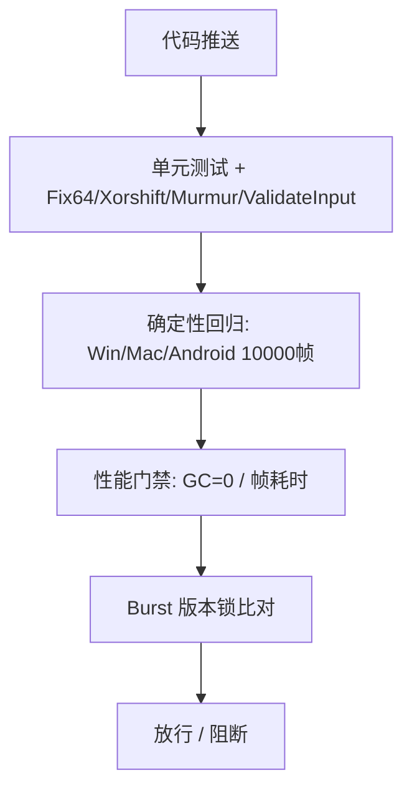

# NoitaCA 测试与 QA 计划（Test & QA Plan）

> **文档版本**：v1.1（在 v1.0 基础上深化）
> **创建日期**：2026-07-06（v1.0）/ **深化日期**：2026-07-07（v1.1）
> **状态**：草稿 / 待评审
> **归属学科**：质量（Quality）
> **维护人（v1.0）**：许清楚（产品经理）+ QA
> **维护人（v1.1 深化）**：QA 工程师（严过关）
> **对齐**：验收诉求来自 `多人联机帧同步对战设计.md §12`、`帧同步Netcode设计.md §11`、`玩法重构方案.md §12`；确定性红线来自 `架构决策记录.md`；协议事实源来自 `协议与序列化规范.md`；风险可追溯性见本文 §13，对齐 `设计审查_2026-07-07.md` 的 **B3（确定性 CI 卡点）** 与 **B5（AimPower 后期追加需协议 version bump）**。

> **v1.0 → v1.1 变更说明（保留既有结构）**：原 v1.0 的 §1–§9 章节内容已**完整保留**并整合进 v1.1 的 §1、§3、§8、§9、§10、§11、§12。本次深化**新增**了：§2（Vertical Slice 测试矩阵）、§4 的确定性回归增强（哈希比对流程 / 失败定位 / B3 CI 卡点）、§5（desync 监控）、§6（帧同步专项）、§7（性能预算增强）、§13（风险可追溯性）。**未修改任何 `架构决策记录.md` 内容。**

---

## 1. 测试策略总览

```mermaid
flowchart LR
    A[单元测试] --> E[CI 门禁]
    B[确定性回归] --> E
    C[性能测试] --> E
    D[网络测试] --> E
    F[帧同步专项] --> E
    G[desync 监控] --> H[线上告警]
    E --> I[可玩版本放行]
    I -.-> J[可玩性测试<br/>(版本后可启)]
```

测试金字塔：底层大量单元 / 确定性测试（自动、快、零随机），上层网络 / 可玩性（需环境）。

**v1.1 新增抓手**：在原有单元/确定性/性能/网络四支柱上，补 **Vertical Slice 测试矩阵（§2）**、**帧同步专项（§6）**、**desync 监控（§5）** 三块，直接对应 `设计审查_2026-07-07.md` 的 B3/B5 风险与「档 B：desync 调试与线上监控规范」缺口。

---

## 2. Vertical Slice 测试矩阵（P0 可执行用例）

> **目的**：把"首版可玩切片（Vertical Slice）"拆成**功能 / 性能 / 兼容性**三维，列出 MVP 必过的 P0 用例。P0 用例全部带**可复现步骤 + 验收标准 + 严重级**，可直接进 CI 冒烟 / 手工验收。
> **切片范围**（对齐 ADR §0 五点自洽）：出界即死（Kill 默认）/ 不缩圈 / 留 Dash（无 i-frames）/ 无 HP / 固定力度 + 循环切换。
> **严重级约定（本 QA 统一）**：`阻塞`= 无法发布；`严重`= 主流程受损需修复；`一般`= 边缘缺陷；`建议`= 体验优化。

### 2.1 三维框架

| 维度 | 关注点 | 用例来源 |
|------|--------|----------|
| **功能** | 施法 / 击退出界 / 道具争夺 / Dash / 结算 行为正确、确定性可回滚 | §2.2 |
| **性能** | 30Hz 逻辑 + 60Hz 渲染下，单帧预算 / GC / 机型覆盖达标（见 §7） | §2.3 |
| **兼容性** | PC（Win/Mac）/ Android / iOS 三平台行为一致、机型矩阵覆盖 | §2.4 |

### 2.2 P0 功能用例（核心玩法）

| 用例ID | 标题 | 前置条件 | 可复现步骤 | 验收标准 | 严重级 |
|--------|------|----------|------------|----------|--------|
| **VS-F1** | 施法（循环切换 + 单施法） | 4 人局，玩家持有 4 槽法术；Mana=100 | 1. 连续按 `SelectNext` 3 次 → `SelectedSpellSlot` 应在 0→1→2→3→0 循环；2. 按 `Attack` 释放当前槽；3. 连续按 `SelectPrev` 验证反向循环 | `SelectedSpellSlot` 推导正确且**确定性可回滚**；`CastSpell` 用 `slots[SelectedSpellSlot]`；每法术独立冷却 + 共享 Mana 双闸生效（Mana 不足施法失败） | 阻塞 |
| **VS-F2** | 击退出界即死（Kill） | 竞技场 256×256，Kill 边界，无 HP | 1. 将玩家逼至边缘 15–55px 内；2. 用重弹(90)/爆炸(150)命中；3. 观察是否推出界（`y>Height+16` 或 `x∉[-16,Width+16]`） | 边缘内被命中→推出界→触发 `PlayerDeath`；轻弹(45)推不出人（边界内不死）；结算最后存活者胜 | 阻塞 |
| **VS-F3** | 道具争夺（Telegraph + 拾取） | 场景事件调度生效，ItemSpawnTable 已配 | 1. 服务器下发 `G2C_SceneEvent{ItemSpawn, TelegraphFrames=90}`；2. 客户端在 `TargetFrame-90` 播放光柱；3. 玩家 A 在 `TargetFrame` 按 `Pickup`；4. 玩家 B 同时争抢 | 光柱 3s 可见（帧延迟解密，客户端 `TargetFrame-3` 前拿不到明文坐标）；拾取走服务器权威；同帧争抢按确定性裁决（如 Entity.Index 升序）唯一归属 | 严重 |
| **VS-F4** | Dash（纯位移 / 无 i-frames） | 玩家 `Dash` 位可用，冷却 54 帧 | 1. 按 `Dash`（bit9）→ 爆发 34px / 0.16s（≈5 帧@30Hz）；2. 空中按 Dash 取消跳跃；3. 撞 Stone/Wood/Ice 即停；4. 入 Water/Lava 减速中断；5. Dash 中被重弹命中推出界 | 位移/耗时/冷却符合 ADR §3 数值；**Dash 期间不免疫击退**（无 i-frames）→ 边缘被推仍出界即死；不与 Kill 规则冲突 | 阻塞 |
| **VS-F5** | 结算（出界即死 → 名次） | 对局进入 `MatchEnded` | 1. 逐人出界直到仅 1 存活；2. 服务器下发 `G2C_MatchSettle`；3. 客户端读出 `Rank`/`Kills`/`Deaths`/`MaterialContribution`（本地派生）+ `MmrDelta`（服务端权威） | 名次=最后存活者冠军；`Deaths∈{0,1}`；`MmrDelta` 由 ELO 变体 K=32 计算；无 HP 项；平局（多人同 `Rank=1`）正确识别 | 阻塞 |
| **VS-F6** | 无 HP / 环境危害非致死 | 含火/毒/酸/熔岩环境 | 1. 玩家长时间处于熔岩；2. 观察是否致死 | 环境材料仅控场/驱赶，**不直接致死**；唯一死因=出界（Kill） | 严重 |
| **VS-F7** | 确定性输入不污染哈希（红线） | 对局中 | 1. 打开暂停菜单 / 发 QuickChat / 点结算按钮；2. 抓 `C2G_Input` 流与每 60 帧 `C2G_StateHash` | 上述 UI 动作**不进 `InputPayload`**（走本地 UI / `C2G_ChatMsg`）；状态哈希不变、不引发 desync（对齐 ADR 确定性红线） | 阻塞 |

### 2.3 性能维度 P0（与 §7 性能预算联动）

| 用例ID | 标题 | 验收（摘要） | 严重级 |
|--------|------|--------------|--------|
| **VS-P1** | 4 人 256×256 单帧逻辑 | 单帧逻辑 <16ms(Win)/<25ms(Android)，30Hz 预算 33.3ms 留余量 | 严重 |
| **VS-P2** | 热路径 GC | 0 字节/帧（Profiler GC Alloc） | 阻塞 |
| **VS-P3** | 8 人上行带宽 | `G2C_FrameBatch` ≈56B/帧；N=8 上行 ≈1.92KB/s（8B payload） | 一般 |
| **VS-P4** | 渲染插值 60Hz | 渲染帧 <16.6ms；中端机稳定 60fps 插值 | 严重 |

### 2.4 兼容性维度 P0（机型矩阵见 §7.4）

| 用例ID | 标题 | 验收（摘要） | 严重级 |
|--------|------|--------------|--------|
| **VS-C1** | 三平台状态哈希一致 | Win/Mac/Android 跑 10000 帧哈希全一致（B3 CI 卡点，见 §4.3） | 阻塞 |
| **VS-C2** | 移动端触控输入确定性 | 触屏摇杆经 `Core.NormalizeMove()` 与 PC 共用同一归一化，模长≤100，哈希一致 | 严重 |
| **VS-C3** | IL2CPP 三平台构建 | Win/Mac/Android IL2CPP 编译零警告成功，行为一致 | 阻塞 |

---

## 3. 单元测试（Unit）

对齐 GAMEPLAY §12.1、§8 确定性改造清单：

| 测试对象 | 验证点 | 工具 |
|---------|--------|------|
| `Fix64` | 加减乘除精度 ≤ 2.3e-10，范围 ±2^15 | NUnit（Editor） |
| `Xorshift128Plus` | 同种子同平台 1000 次结果一致（链式初始化） | NUnit |
| `MurmurHash3` | 全 9 字段哈希，`&0xFFFF` 掩码防符号扩展 | NUnit |
| 材料反应表 | 12 材料 × 反应表输出正确（水+火→蒸汽…） | NUnit |
| `ArenaConfig` | `PlayerCount` 夹取 [2,8]、`Mode` 枚举有效 | NUnit |
| 道具刷新表 | 权重抽样分布符合 `ItemSpawnTable` | NUnit（统计） |
| `NormalizeMove()` | PC 与移动端共用，模长严格 ≤100，`clamp(round(x*100),-100,100)` | NUnit（PC/移动端双端） |
| `ValidateInput()` | 范围/模长/`AimAngle`/`FORBIDDEN` 保留位/帧频率/位移幅度（见 §6.2） | NUnit |

> 所有数学测试**禁用浮点**，`float`/`double` 仅限 Burst 内部且 `FloatMode.Strict`。
> **v1.1 新增**：`NormalizeMove()` 与 `ValidateInput()` 单测（支撑 §6 帧同步专项与 ADR 红线）。

---

## 4. 确定性回归（Deterministic Regression）— 核心

对齐架构文档 §12.1、GAMEPLAY §12.2、FRAME_SYNC §11：

| 用例 | 条件 | 验收 |
|------|------|------|
| 三平台哈希一致 | 相同输入，Win / Mac / Android 跑 **10000 帧** | 状态哈希完全相同 |
| 多线程 = 单线程 | 同输入，并行 vs 串行模拟 | 哈希一致（验证 chunk 排序 / 冲突解决正确） |
| 奇偶帧迭代 | 偶数正向 / 奇数反向 | 哈希一致 |
| Burst 版本升级 | 升级 Burst 后回归 | 仍一致（否则锁版本） |
| 环境层区域哈希 | dirty chunk `MurmurHash3` 多数派裁决 | ≥2 票一致 |

**回归脚本要点**：
- 种子固定，输入脚本化（无随机、无 `Time.deltaTime`）。
- 输出每 60 帧状态哈希，比对文件 diff。
- CI 三平台矩阵（见 §10 / §4.3）。

### 4.1 状态哈希比对流程（v1.1 新增）

确定性回归的本质是"**同输入 → 同状态序列 → 同哈希序列**"。比对按以下流程执行：

```
1. 准备阶段
   ├─ 固定 ArenaConfig.Seed（服务器下发种子，确定性生成地形）
   ├─ 固定输入脚本（DeterminismRunner 回放预录 InputRingBuffer，无随机/无 Time.deltaTime）
   └─ 固定 BurstVersion（CI 锁定 1.8.29，见 §10）

2. 执行阶段（三平台各自离线跑 10000 帧）
   ├─ 每帧推进 dt=1/30 固定步长
   ├─ 每 60 帧（0.5Hz）计算全量状态哈希 MurmurHash3 → Hash128
   │     └─ 参与哈希字段：玩家层(位置/速度/flags/SelectedSpellSlot/Mana) + 环境层(dirty chunk 摘要) + PRNG 状态 + 帧号
   └─ dump 哈希序列到 hash_<platform>.log：每行 {frame, hash}

3. 比对阶段（CI 自动）
   ├─ 逐行 diff 三平台 hash 序列（Win vs Mac vs Android）
   ├─ 全 167 个采样点（10000/60≈167）完全一致 → PASS
   └─ 任一采样点不一致 → FAIL，进入 §4.2 失败定位

4. GC 门禁（并行）
   └─ Profiler GC Alloc 扫描热路径，0 字节/帧 才 PASS
```

**哈希字段约定**（对齐协议 §2 与 ADR §6）：凡进入 `InputPayload` 的字段都参与锁步状态哈希。故 `PauseMenu`/`QuickChat`/结算按钮不进 `InputPayload`（走本地 UI / `C2G_ChatMsg`），不污染哈希、不导致 desync —— 这是 **ADR 确定性红线**，也是本比对流程不变量。

### 4.2 失败定位手段（v1.1 新增）

确定性回归失败必须**可定位到具体系统/帧/字段**，不允许"偶尔不一致"。定位流程：

```
步骤 A · 帧级二分（bisect）
  1. 比对三平台 hash 序列，找到首个分歧采样帧 F0（60 的倍数）
  2. 在 F0 前后做更细粒度 dump（每 1 帧），缩小到首个分歧帧 F1（非 60 倍数也可）
  3. 记录 F1 之前的最后一个共识帧 F_c（状态仍一致）

步骤 B · 模块级哈希（定位"哪一类状态分歧"）
  在 F_c..F1 区间，分别 dump 分模块哈希：
   ├─ H_player  ：玩家层（角色/法术/生物/道具状态）
   ├─ H_env     ：环境层（CA 像素 dirty chunk 摘要）
   ├─ H_prng    ：Xorshift128Plus 状态
   └─ H_input   ：输入队列 / InputRingBuffer
  比对 → 定位分歧模块：
   ├─ H_player 分歧 → 查玩家模拟 Job / 击退 / Dash / 法术
   ├─ H_env 分歧   → 查 CA 冲突解决 (x,y) 字典序 / 迭代方向(奇偶帧) / 周期调和
   ├─ H_prng 分歧  → 查 Xorshift128Plus 链式初始化 / 种子注入 / 调用顺序
   └─ H_input 分歧 → 查 InputPayload 序列化 / 归一化 / 边沿结算

步骤 C · 平台对拍
  ├─ 若仅某一平台（如 Android）独立分歧 → 查该平台 Burst 代码生成差异 / FloatMode.Strict 是否生效 / 编译器版本
  └─ 若 Win==Mac≠Android → 重点查 ARM64 IL2CPP 与 x64 的差异（如 int64 溢出、移位行为）

步骤 D · 字段级 diff（确定性 replay）
  1. 用确定性的离线 replay 从 F_c 重跑到 F1
  2. 在 F1 处 dump 全量实体快照（position/velocity/flags/SelectedSpellSlot/Mana/PRNG state）
  3. 对拍分歧两端快照，字段级 diff 出首个不同字段 → 定位到具体 Job/系统/行

步骤 E · 二分缩小范围
  若仍无法定位，在 F_c..F1（≤60 帧）内二分注入"模块哈希探针"，逐步收敛到具体系统。
```

**交付物要求**：每次 CI 失败，报告须包含 `F0 / F1 / 分歧模块 / 分歧字段 / 涉及平台` 五项，方可阻断合并（见 §4.3）。

### 4.3 CI 卡点 / B3 门禁（v1.1 新增 · 对齐 DESIGN_REVIEW B3）

> **B3 风险**：`设计审查_2026-07-07.md` B3 明确"确定性 CI 卡点未确认落地"是**高危风险**——确定性是帧同步生命线，若无 CI 强制门禁，重构期极易无声引入浮点/字典序/PRNG 分歧。**本 § 即为 B3 的落地卡点。**

| 项 | 定义 |
|----|------|
| **门禁名称** | B3 确定性 CI 卡点 |
| **触发** | 每次 PR 推送 / merge 到 `main` |
| **阻塞级别** | **最高优先级**，失败 = 阻断合并（不可豁免、不可"先合后修"） |
| **步骤** | ① IL2CPP 编译 Win/Mac/Android → ② `DeterminismRunner` 三平台各跑 10000 帧（固定种子+脚本化输入）→ ③ 每 60 帧 dump 状态哈希 → ④ 三平台哈希序列 diff 全一致 → ⑤ 热路径 GC Alloc=0 → ⑥ `BurstVersion` 比对锁定 1.8.29 |
| **通过标准** | 167 个采样点全一致 **且** GC=0 **且** Burst 版本一致 |
| **失败动作** | 阻断合并 + 自动输出 §4.2 五项定位信息（F0/F1/模块/字段/平台） |
| **三平台矩阵** | Win（x64）/ Mac（ARM64，云端）/ Android（ARM64 IL2CPP）；Mac 需云端构建 |

**B3 与发布门禁的关系**：B3 是 CI 层的"确定性红线守门员"；§11 发布门禁将其列为强制项。任何绕过 B3 的合并，视为违反 ADR 确定性红线。

---

## 5. desync 监控（对局内 / 线上）— v1.1 新增

> **对齐说明**：`设计审查_2026-07-07.md` 把"desync 调试与线上监控规范"列为**档 B 缺失项**；团队主理人在任务中将其标注为 **B5 关注项**。本节同时覆盖"对局内 hash 不一致探测"与"回放/日志定位"两块，闭合该缺口。
> **MVP 边界**（ADR §8 遗留项 8）：整局**视频回放**录制为 P4+ 特性，MVP 隐藏。故 MVP 的 desync 定位手段 = **确定性输入日志 replay**（非视频），即：服务器保存状态哈希历史 + 客户端保存 `InputRingBuffer` 与 `ArenaConfig.Seed` → 事后用同输入+同种子离线 replay 复现分歧。

### 5.1 对局内 hash 不一致探测

| 机制 | 规则（对齐架构 §5.4 / §9.2） |
|------|------------------------------|
| 上报频率 | 客户端每 **60 帧（2s）** 发送 `C2G_StateHash{frame, hash}` |
| 多数派裁决 | 阈值 `⌊N/2⌋+1`：N=2→2（全票），N=4→3，N=8→5；多数派哈希为权威 |
| 少数派处理 | 标记 `MismatchCount++`；**连续 3 次少数派 → 踢出房间** |
| 全不一致 | 标记对局"异常"（`FlagMatchAnomaly`），录像/日志送人工分析 |
| 0 误报要求 | 状态哈希 60 帧比对必须 **0 误报**（架构 §12.2）—— 误报会误踢正常玩家 |

**探测用例（P0）**：

| 用例ID | 标题 | 可复现步骤 | 验收 | 严重级 |
|--------|------|------------|------|--------|
| DS-1 | 单点 desync 探测 | 1. 构造 1 客户端注入非法输入（置保留位）→ 其状态哈希偏离 | 该客户端被标记为少数派；连续 3 次后踢出；其余正常 | 严重 |
| DS-2 | 全量异常 | 1. 所有客户端因同一 Bug 哈希全不一致 | 对局标记 anomaly，送人工；不误踢（无多数派） | 严重 |
| DS-3 | 0 误报验证 | 1. 正常 4 人局跑 5min | 0 次误标记 / 0 误踢 | 阻塞 |

### 5.2 回放定位（确定性日志 replay）

```
1. 服务器在 G2C_HashMismatch{frame, majorityHash, minorityHash} 中标记分歧帧 F
2. 客户端取出本地 InputRingBuffer（最近 30 帧 + 周期调和快照）+ ArenaConfig.Seed
3. 离线 DeterminismRunner 从 F-300 重跑到 F：
   ├─ 若本地 replay 哈希 == 服务器 majorityHash → 客户端实现正确，问题在少数派/网络
   └─ 若本地 replay 哈希 == 自身异常哈希 → 客户端存在确定性 Bug（定位到本机 Job）
4. 在 F 处 dump 实体快照做字段级 diff（同 §4.2 步骤 D）
5. 日志结构化落盘（每帧：输入 / 场景事件 / PRNG 状态），供 devops 事后 replay
```

**MVP 可达性**：输入日志 replay 不需要整局视频，仅依赖既有的 `InputRingBuffer` + `Seed` + 状态哈希历史环形缓冲（架构 §5.4 `CircularBuffer<(Frame,Hash)>`），**MVP 即可落地**。

### 5.3 告警与监控大盘

| 项 | 定义 |
|----|------|
| 客户端告警 | 收到 `G2C_HashMismatch` / `G2C_NetworkWarning` → 本地提示 + 上报 |
| 服务端告警 | 连续 minority / anomaly → 触发运维告警（devops 大盘接入，闭合 DESIGN_REVIEW 档 B 缺口） |
| 监控指标 | desync 率、踢出率、anomaly 数、按机型/版本/BurstVersion 维度下钻 |

---

## 6. 帧同步专项 — v1.1 新增

### 6.1 rollback 正确性（GGPO 风格）

| 参数 | 值 | 来源 |
|------|----|------|
| 输入延迟 | `INPUT_DELAY=2` 帧（66ms） | 协议 §2 |
| 最大回滚 | `MAX_ROLLBACK=7` 帧（233ms） | 协议 §2 |
| 玩家层 | 每帧输入锁步 + 轻量 GGPO 回滚（状态量 ~2.5KB/帧） | 架构 §1 |
| 环境层 | 周期调和（每 6 帧 200ms 服务端快照），**不实时回滚** | 架构 §1/§8.3 |

| 用例ID | 标题 | 可复现步骤 | 验收 | 严重级 |
|--------|------|------------|------|--------|
| RB-1 | 回滚重放一致性 | 1. 单机模拟 4 人输入失配，注入随机；2. 触发回滚 ≤7 帧；3. 重放后比对"无失配基线"状态哈希 | 回滚后状态哈希与基线完全一致（1000 帧） | 阻塞 |
| RB-2 | INPUT_DELAY=2 验证 | 1. 采集输入帧 T；2. 验证在 T+2 才应用；3. 预测/回滚期间表现正确 | 输入延迟精确 2 帧；预测不泄漏到权威状态 | 严重 |
| RB-3 | 回滚跨周期调和 | 1. 制造回滚跨越第 6 帧环境快照边界 | 环境层用快照覆盖而非重算，回滚不破坏环境一致性 | 严重 |
| RB-4 | 回滚无副作用 | 1. 回滚区间重放 | 回滚期间不引入浮点/随机；`ReplayForward` 重放全部动作（含 `SelectNext/Prev`/`UseConsumable`/`Dash`）重建 `SelectedSpellSlot` | 阻塞 |

### 6.2 输入校验 ValidateInput（对齐 ADR 确定性红线）

**ADR 红线（核心约束）**：凡进入 `InputPayload` 的字段都参与锁步状态哈希。故 **`PauseMenu` / `QuickChat` / 结算按钮不进 `InputPayload`**（走本地 UI / `C2G_ChatMsg`），不污染哈希、不导致 desync。

`AntiCheatSystem.ValidateInput`（协议 §8 / 架构 §9.2）校验项：

```csharp
public bool ValidateInput(uint playerId, InputPayload input, long frame)
{
    // 1. 帧频率：dt = frame - LastInputFrame < 1 → 拒绝（同帧/乱序）
    if (frame - player.LastInputFrame < 1) return false;
    // 2. 移动向量范围
    if (Math.Abs(input.MoveX) > 100 || Math.Abs(input.MoveY) > 100) return false;
    // 3. 模长（防斜向加速）
    if (Math.Sqrt((long)input.MoveX*input.MoveX + (long)input.MoveY*input.MoveY) > 100) return false;
    // 4. 瞄准角范围
    if (input.AimAngle < 0 || input.AimAngle > 628) return false;
    // 5. 保留位禁用（A5）：bit2/3 与 bit10-15 必须全 0
    const ushort FORBIDDEN = (1<<2) | (1<<3) | 0xFC00; // bit2,3 + bit10-15
    if ((input.ActionFlags & FORBIDDEN) != 0) return false;
    // 6. 位移幅度（防瞬移）：maxMove = MaxSpeed/30*1.5（基于 PlayerData.Position）
    //    ...（架构 §9.2 原文）
    return true;
}
```

| 用例ID | 标题 | 可复现步骤 | 验收 | 严重级 |
|--------|------|------------|------|--------|
| VI-1 | 红线：UI 不进 InputPayload | 1. 对局中打开暂停菜单 / 发 QuickChat / 点结算按钮；2. 抓包 `C2G_Input` 与 `C2G_StateHash` | 上述动作不出现于 `C2G_Input`；状态哈希不变；无 desync | 阻塞 |
| VI-2 | 保留位禁用 | 1. 客户端构造 `ActionFlags` 置 bit2/3/bit10-15；2. 发 `C2G_Input` | 服务器 `ValidateInput` 拒绝（`FORBIDDEN` 命中）→ 视为非法/踢出 | 阻塞 |
| VI-3 | 越界输入拒绝 | 1. 构造 `MoveX=200` / `AimAngle=999` / 模长=150 | 服务器拒绝；边界值（模长=100、AimAngle=628）通过 | 严重 |
| VI-4 | 帧频率/乱序拒绝 | 1. 同帧重发 / 倒序帧号 | `dt<1` → 拒绝 | 严重 |
| VI-5 | 位移幅度防瞬移 | 1. 单帧位移 > `MaxSpeed/30*1.5` | 拒绝（基于 `PlayerData.Position`，非 input 本身） | 严重 |
| VI-6 | PC/移动端归一化一致 | 1. 同摇杆偏移分别经 PC 键盘 / 触屏采集 | 两路径共用 `Core.NormalizeMove()`，产出 `InputPayload` 完全一致 | 严重 |

### 6.3 协议版本兼容（ProtocolVersion bump · 对齐 DESIGN_REVIEW B5）

> **B5 风险**：`设计审查_2026-07-07.md` B5 = "AimPower 后期追加需协议 version bump（input-arch 已预警）"。本协议已落地**第一次 bump**：删除 `SpellId` → `ProtocolVersion` **1→2**（协议 §7）。本节 QA 卡点确保：**当前 v2 兼容校验生效**，且**未来第 N 次 bump（如 B5 的 AimPower）机制可被正确拒绝旧客户端**。

| 项 | 值 / 规则 |
|----|-----------|
| 当前 `ProtocolVersion` | **2**（因删除 `SpellId` bump） |
| 基线 | 1（含 `SpellId`，已被取代） |
| 不兼容处理 | 版本不匹配 → 拒绝进对局 / 重新连接 |
| 保留位禁用 | bit2/3、bit10-15 禁用**不**触发 bump（向后兼容），但 `ValidateInput` 必须拒绝置位 |
| 回溯机制（B5 防护） | 新增动作走 bit10-15；新增字段走追加字段 + bump `ProtocolVersion`（输入架构 §11.3） |

| 用例ID | 标题 | 可复现步骤 | 验收 | 严重级 |
|--------|------|------------|------|--------|
| PV-1 | 旧客户端拒绝（v1） | 1. 用含 `SpellId`(12B) 的旧客户端连接期望 v2 的服务器 | `C2G_ClientVersionReport.ProtocolVersion` 不匹配 → 拒绝进对局 | 阻塞 |
| PV-2 | 新客户端放行（v2） | 1. v2 客户端连接 | 通过 | 阻塞 |
| PV-3 | BurstVersion 不一致 | 1. 客户端 Burst 版本与服务器不同 | 拒绝（防跨版本 Burst 破坏确定性） | 严重 |
| PV-4 | HotfixHash / AssetManifestHash 不一致 | 1. 房间内 N 人资源哈希不一致 | 服务器拒绝开始对局（提示"玩家 X 资源版本不一致"） | 严重 |
| PV-5 | 未来 bump 机制（B5 预演） | 1. 模拟追加 `AimPower` 字段 → bump 到 v3；2. 旧 v2 客户端连接 | 旧客户端被拒；新客户端通过；验证回溯机制（新增位走 bit10-15 / 新增字段走追加+bump） | 严重 |
| PV-6 | 协议导出校验 | 1. 改 `OuterMessage.proto` 跑 `ProtocolExportTool` | 字段号无冲突、无破坏式 schema 变更（MemoryPack）；否则 CI 阻断 | 一般 |

---

## 7. 性能测试与性能预算（Performance）

硬件基准（GAMEPLAY §12.4）：**i7-12700H（Win 开发机）+ Android 中端机（骁龙 7 Gen 1 级）**，两档均须满足。

### 7.1 帧率模型与预算（v1.1 新增）

| 维度 | tick | 单帧预算 | 说明 |
|------|------|----------|------|
| **逻辑** | 30 Hz | **33.3 ms** | 输入锁步 + 玩家层 + 环境层 CA + 快照 + 调和（架构 §8.1） |
| **渲染** | 60 Hz | **16.6 ms** | 插值渲染，与逻辑解耦 |

> 逻辑预算 33.3ms 是上限；QA 门禁取更严的单帧逻辑耗时（见 §7.2），留网络/调度余量。

### 7.2 性能门禁阈值（原 §4 增强）

| 指标 | 阈值（Win） | 阈值（Android） | 测量方式 |
|------|------------|----------------|---------|
| 单帧逻辑耗时（256×256） | < 16ms（30Hz 预算 33ms） | < 25ms | Profiler |
| 环境层 CA 单帧 | < 15ms（架构 §8.1 阶段 3 预算） | < 15ms | Profiler |
| 热路径 GC | **0 字节/帧** | 0 字节/帧 | Profiler GC Alloc |
| 主线程 `SetPixels32` | < 2ms | < 5ms | Profiler |
| MovementJob 加速比 | ≥ 2×（8 核） | ≥ 1.5× | 单线程 vs IJobChunk |
| GameBootstrap 加载 | < 3s | < 6s | 计时 |
| Burst 覆盖率 | 100% 玩法 Job | 100% | Burst Inspector |

### 7.3 CPU / GPU / 内存预算（v1.1 新增）

| 资源 | 预算（Win / Android 中端） | 备注 |
|------|---------------------------|------|
| **CPU 逻辑线程** | 单帧 < 16ms / < 25ms | 含玩家层 + 环境层 + 快照 + 调和 |
| **CPU 渲染线程** | 帧 < 16.6ms | 60Hz 插值；逻辑/渲染解耦 |
| **CPU 主线程** | 单帧 < 33ms | 输入收集/UI 不阻塞锁步 |
| **GPU 帧时间** | < 16.6ms @ 目标分辨率 | RGB565 16 位降低带宽；禁用 bloom/抖动（美术风格指南）→ GPU 负载可控 |
| **GPU overdraw** | 受控（无透明叠加爆炸） | Telegraph 用高对比固定色 + 形状，非光晕 |
| **内存 · 热路径分配** | 0（GC=0） | 确定性回滚依赖零分配 |
| **内存 · 对局峰值** | Win ≤ 1.5GB / Android 中端 ≤ 1.0GB / 低端 ≤ 700MB | 快照缓冲（玩家层 2.5KB/帧；环境层 16KB 分片）+ CA 世界 |
| **内存 · 包体** | IL2CPP 三平台；资源 YooAsset 按需 | 对局前资源版本对齐校验 |

### 7.4 移动端机型覆盖矩阵（v1.1 新增）

| 档位 | SoC（Android）/ 芯片（iOS） | 目标分辨率 | 逻辑帧 | 渲染帧 | 内存上限 | 备注 |
|------|------------------------------|------------|--------|--------|----------|------|
| **旗舰** | 骁龙 8 Gen3 / 天玑 9300 / A17 Pro | 原生 | 30Hz | 60Hz | ≤ 1.2GB | 全特效 + 插值 |
| **中端（基准）** | 骁龙 7 Gen1 / 天玑 8200 / A15 | 原生 | 30Hz | 60Hz（插值） | ≤ 1.0GB | **性能门禁基准机**（对齐 GAMEPLAY §12.4） |
| **低端（最低可行）** | 骁龙 6 Gen1 / Helio G99 / A13 | 降分辨率 | 30Hz | 30Hz（关插值兜底） | ≤ 700MB | 可玩下限，超阈值则降配 |
| **iOS 覆盖** | iPhone SE3(A15) / iPhone13(A15) / iPhone15(A16) | 原生 | 30Hz | 60Hz | 同档 | 需单独 iOS 构建验证 |

> 机型矩阵须纳入 CI 真机云测（非模拟器）；中端机为**强制达标档**，低端机为**降级可达档**。

---

## 8. 网络测试（Netcode）

对齐 FRAME_SYNC §11、架构文档 §12.2：

| 测试 | 场景 | 验收 |
|------|------|------|
| 回滚正确性 | 单机模拟 4 人输入失配，注入随机 | 回滚后状态哈希与服务端一致（1000 帧） |
| 断线重连 | 4 人局断 1 人 / 2 人局断 1 人 | 30s 内重连，状态恢复一致 |
| 时钟同步 | ping 100ms 抖动 50ms，对局 5 min | 无 desync |
| Jitter Buffer | ping 200ms ±50ms | 无卡顿 |
| Catch-up | 落后 2-10 帧 | 分级追上；>10 帧走全量快照 |
| 观战延迟 | 死亡玩家 1s / 默认 10s | 无信息泄露 |
| 慢速踢出 | 落后 30 帧（1s） | 踢出；15 帧先警告 |
| 状态哈希裁决 | 60 帧比对 | 0 误报；连续 3 次少数派踢出 |

规模覆盖：N=2 / 4 / 8 三档实测（架构 §12.2）。

---

## 9. 协议 / 接口测试

- 协议导出后 proto 字段号无冲突、无破坏式 schema 变更（MemoryPack）。
- `C2G_ClientVersionReport` 五元组（HotfixHash / Signature / AssetManifestHash / ProtocolVersion / BurstVersion）校验逻辑单测。
- Hotfix.dll RSA 签名：篡改 → 验签失败 → 连接拒绝（架构 §9.3）。
- `G2C_MatchSettle` protobuf 解析：字段与 `结算界面规格` 对应（`Rank`/`Kills`/`Deaths`/`MaterialContribution` 本地派生，`MmrDelta` 服务端权威）；`ReplayAvailable` 恒 false（MVP 隐藏回放）。

---

## 10. CI 集成



- 三平台矩阵用云构建（Mac 需云端）。
- 确定性回归失败 = 阻断合并（最高优先级，见 §4.3 **B3 卡点**）。
- Burst 版本锁定 1.8.29，CI 比对 `BurstVersion` 字段（架构 §4.5.4）。
- **v1.1 新增 CI 阶段**：`ValidateInput` 单测 → `PV-*` 协议版本兼容门禁 → 性能预算真机云测（§7.4 机型矩阵）。

---

## 11. 验收清单（Release Gate）

- [ ] 单元测试全绿（Fix64 / Xorshift / Murmur / 反应表 / ArenaConfig / NormalizeMove / ValidateInput）
- [ ] **B3 卡点**：三平台（Win/Mac/Android）10000 帧状态哈希一致
- [ ] 多线程 = 单线程哈希一致
- [ ] 热路径 GC = 0
- [ ] 单帧逻辑 < 16ms（Win）/ < 25ms（Android）
- [ ] N=2/4/8 网络对局无 desync
- [ ] 断线 30s 内重连成功
- [ ] 状态哈希 60 帧比对 0 误报
- [ ] **desync 监控**：对局内 hash 不一致探测 + 回放定位（DS-1/2/3 通过）
- [ ] **帧同步专项**：rollback 正确性（RB-1/4）、ValidateInput 红线（VI-1/2）、协议版本兼容（PV-1/2）
- [ ] Hotfix.dll 篡改 → 连接拒绝
- [ ] 房间内 AssetManifestHash 不一致 → 拒开始
- [ ] 编译零警告、IL2CPP 三平台成功
- [ ] 移动端机型矩阵（中端达标 / 低端降级可达）性能预算通过

---

## 12. 暂缓章节（待可玩版本后启动）

- **可玩性测试（Playtesting）**：手感、节奏、趣味点验证（GDD §10）。依赖可玩构建，须先完成 GDD + 本计划自动化部分。版本可达 Phase 6 后由 QA 启动。
- **平衡性数据测试**：道具权重 / MMR 调参，基于 QA 回归与对局数据迭代（见 GDD §11 开放问题）。
- **整局视频回放**（ADR §8 遗留项 8）：P4+ 特性，MVP 隐藏「查看回放」；MVP 用确定性输入日志 replay（§5.2）替代。

---

## 13. 风险可追溯性（B3 / B5 + ADR 确定性红线对齐）— v1.1 新增

> 本节显式闭合任务要求"对齐 ADR 确定性红线与 B3/B5 风险"，消除编号歧义。

| 风险 / 红线 | 来源 | 本文落点 | 门禁 |
|------------|------|----------|------|
| **B3 确定性 CI 卡点未确认落地** | DESIGN_REVIEW §B3（高危） | §4 确定性回归 + §4.3 **B3 CI 卡点** + §10 CI + §11 发布门禁 | 10000 帧三平台哈希一致 + GC=0，失败阻断合并 |
| **B5 AimPower 后期追加需协议 version bump** | DESIGN_REVIEW §B5（中风险，input-arch 已预警） | §6.3 协议版本兼容（PV-1~PV-6，含 B5 预演） | 旧客户端拒绝 + 回溯机制校验 |
| **desync 调试与线上监控规范缺失** | DESIGN_REVIEW 档 B 缺失项 | §5 desync 监控（DS-1/2/3 + 回放定位 + 大盘） | 对局内 0 误报探测 + 日志 replay 定位 |
| **ADR 确定性红线：UI 不进 InputPayload** | ADR §6 / 协议 §2 | §4.1 哈希字段约定 + §6.2 ValidateInput（VI-1 红线用例） | PauseMenu/QuickChat/结算按钮不污染哈希 |
| **ADR D3 Dash 无 i-frames** | ADR §3 | §2 VS-F4 | Dash 期间可被击退推出界即死 |
| **ADR D4 无 HP / 环境非致死** | ADR §4 | §2 VS-F5/VS-F6 | 唯一死因=出界 |
| **Burst 跨版本确定性变化** | 架构 §13 风险登记 | §4.3 BurstVersion 锁比对 + §6.3 PV-3 | Burst 版本不一致拒绝 |

**红线一句话总结**：凡进 `InputPayload` 的字段 → 参与锁步状态哈希 → 三平台 10000 帧必须一致（B3）；凡**不**进 `InputPayload` 的（暂停/聊天/结算 UI）→ 红线保证不污染哈希、不 desync。

---

> **本计划由 QA 工程师（严过关）执行与维护。**

**文档结束（v1.1）**
