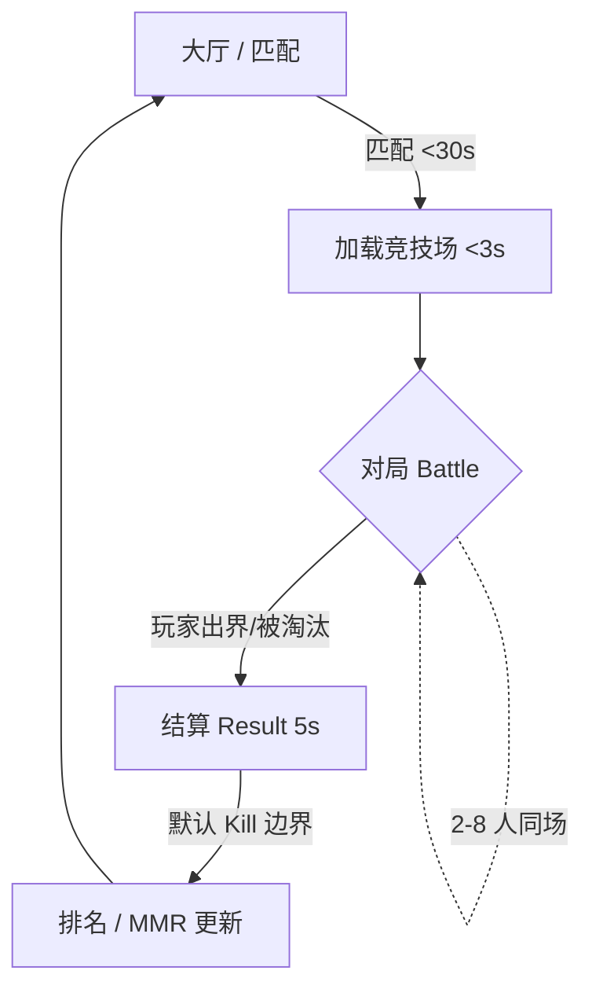

# NoitaCA 游戏设计文档（GDD）

> **文档版本**：v1.0
> **创建日期**：2026-07-06
> **状态**：草稿 / 待评审
> **归属学科**：设计（Game Design）
> **维护人**：许清楚（产品经理）
> **对齐说明**：本文描述"游戏怎么好玩"，玩法规则与技术约束（确定性、帧同步、程序集边界）对齐 `多人联机帧同步对战设计.md` / `玩法重构方案.md`，但不重复其技术实现细节。

---

## 1. 一句话定位

> **Noita 风格的像素落沙 + 2-8 人可配置房间（默认 4 人乱斗）的帧同步对战 / 大逃杀**：用流动的像素材料改变战场，把对手"挤出"竞技场边界即获胜（百战天虫规则）。

核心张力：**战场本身是可被破坏、可被你改造的武器**——挖坑、放水、放火、造墙，用环境打败对手，而不是比谁枪法准。

---

## 2. 核心体验目标（体验支柱）

| 支柱 | 设计意图 | 趣味来源 |
|------|---------|---------|
| **环境即武器** | 落沙材料是核心玩法，不是背景 | 玩家主动改造地形制造杀机（引水灌坑、火墙封路） |
| **低门槛高上限** | 移动 + 少量操作即可上手 | 材料组合、时机博弈、心理博弈带来深度 |
| **短局快节奏** | 单局 5 分钟内结束 | 死亡即重开，损失感低、爽感循环快 |
| **可读的混乱** | Telegraph 预告 + 像素清晰 | 再混乱的场面也能读懂"接下来会发生什么" |
| **公平确定性** | 帧同步 + 服务器裁决 | 无外挂信息优势，输赢只靠操作与决策 |

---

## 3. 核心循环（Core Loop）

- 目标：每步 < 3s，单局（4 人乱斗）从匹配到结算 < 8 分钟。
- 对局内节奏：开局抢点（道具 Telegraph 3s 可见）→ 中期材料博弈 → 残局 1v1 边界博弈。

---

## 4. 胜负与边界死亡规则

### 4.1 房间规模与模式

| 模式 | 人数 | 配置 | 说明 |
|------|------|------|------|
| 自建房 Custom | 2-8（房主设定） | 自由配置地图/边界/刷新 | 好友开黑 |
| 快速匹配 Quick Match | 默认 4（可选 2） | 标准 256×256 / Kill 边界 | 秒开 |
| 排位赛 Ranked | 默认 4 | 强制标准配置 / 禁对手文本 | ELO 计分 |

### 4.2 边界死亡规则（百战天虫）

玩家像素中心越过竞技场边界即死亡：

- 玩家中心 `y > Height + 16` 或 `x ∉ [-16, Width + 16]` → 触发 `PlayerDeath`。
- 死亡玩家进入观战（1 秒延迟），可发快捷表情。
- 最后存活者 / 达到胜利条件者获胜。

**三种边界模式**（房主 / 匹配可配置，默认 `Kill`）：

| 模式 | 行为 | 玩法差异 |
|------|------|---------|
| `Kill` | 出界即死（默认） | 把人"挤出去"是核心目标 |
| `Bounce` | 边界反弹 | 更强调材料战，边界不可直接杀 |
| `Wrap` | 环绕（对侧出现） | 混沌玩法，适合娱乐局 |

### 4.3 胜利条件（默认）

- **大逃杀**：最后存活者胜；多人同时出界按出界顺序定名次。
- 排位赛：胜者 +N MMR，按名次（1=冠军, N=末位）结算。

---

## 5. 材料与反应体系（12 种 + 反应表）

> 对齐 `玩法重构方案.md §4.1.1` 的 `PixelData.MaterialType`（12 种）、`MaterialDefinition`（密度 / 熔点 / 燃点 / RGB565 默认色）。视觉色值详见 `美术风格指南.md`。

### 5.1 十二材料

| # | 材质 | 形态 | 核心玩法特性 |
|---|------|------|------------|
| 1 | 沙 Sand | 粉末 | 重力堆积，可掩埋 / 填坑 |
| 2 | 水 Water | 液体 | 流动、导电、灭火、灌坑 |
| 3 | 石 Stone | 固体 | 静止阻挡，酸无法腐蚀 |
| 4 | 木 Wood | 固体 | 可燃，易燃蔓延 |
| 5 | 火 Fire | 气体/能量 | 高温点燃、短寿命、伤害 |
| 6 | 烟 Smoke | 气体 | 上升、遮蔽视野 |
| 7 | 蒸汽 Steam | 气体 | 上升、冷凝回水 |
| 8 | 冰 Ice | 固体 | 阻滑、遇火融水 |
| 9 | 熔岩 Lava | 液体 | 高温点燃、冷却成石 |
| 10 | 酸 Acid | 液体 | 腐蚀（除石外溶解） |
| 11 | 毒 Poison | 液体/气体 | 持续伤害、可挥发 |
| 12 | 灰烬 Ash | 粉末 | 重力堆积、惰性 |

### 5.2 反应表（玩家可读的"化学"）

| 反应物 A | 反应物 B | 结果 | 战术含义 |
|---------|---------|------|---------|
| 水 | 火 | → 蒸汽 | 灭火、造雾 |
| 火 | 木 | → 灰烬（火蔓延） | 烧穿木墙、逼迫走位 |
| 熔岩 | 木 | → 火 | 火墙推进 |
| 熔岩 | 水 | → 石 + 蒸汽 | 瞬间造墙 / 封路 |
| 冰 | 火 | → 水 | 解冻、制造滑面 |
| 酸 | 除石外物质 | → 溶解消失 | 清场、破防 |
| 火 | 毒 | → 爆炸（范围伤害） | 高风险高回报连招 |
| 水 | 毒 | → 稀释（毒变水） | 解毒、反制 |
| 蒸汽 | 低温环境 | → 水 | 冷凝循环 |

> **设计意图**：反应表是"可读性混乱"的基石——玩家看到材料组合就能预判结果，从而做决策而非盲打。

---

## 6. 玩家能力 / 法术 / 生物 / 装备

> 对齐架构文档 §7.4 道具表、§4.4 玩家配置。系统描述聚焦"玩家能做什么"，不重复 ECS 实现。

### 6.1 玩家基础能力

| 能力 | 操作 | 说明 |
|------|------|------|
| 移动 | 方向键 / 摇杆 | 自定义 2D 像素碰撞，不依赖 Unity Physics |
| 跳跃 | Jump | 基础位移，可被材料阻碍 |
| 瞄准 | AimAngle [0, 2π] | 施法 / 投掷方向 |
| 拾取 / 丢弃 | Pickup / Drop | 拾取地面道具，丢弃交换 |
| 冲刺 | Dash | 一次性定向位移，固定 CD，**MVP 无无敌帧**（见 §6.1.1） |

#### 6.1.1 冲刺（Dash）

- **操作**：`Dash`（InputActionFlags bit9）。向当前瞄准 / 移动方向快速突进固定距离的一次性位移技能。
- **设计目的**：快速脱离险境（被推出边界前的自救窗口）、抢占地形、绕后突袭，提升走位上限而不破坏"出界即死"的核心张力。
- **冷却**：固定 CD（具体位移量 / CD 数值见 `数值平衡设计.md` 位移章节）。CD 内再次触发由服务端 `ValidateInput` 确定性拒绝，不进入 `InputPayload`。
- **MVP 无无敌帧**：冲刺期间**不免疫**击退与材料伤害。理由（ADR §3）：本作无 HP，i-frames 无法"免伤"只会"免推"，将削弱推出界外的击杀张力，故 MVP 不实现；无 i-frames 也降低确定性回归（rollback）的复杂度。
- **确定性约束**：位移量、CD 均为定点数常量，不引入随机；客户端 60Hz 插值，逻辑 30Hz 帧同步。

### 6.2 法术（Spell）

- 法术来源：初始固定 1-2 个 + 道具卷轴临时学习（最多 4 槽，4 bit 编码）。
- 元素法术：火 / 冰 / 毒 / 酸 / 投掷物，弹道为直线 / 抛物线 / 光束。
- 命中以像素采样判定，范围效果写入像素（与 5.1 材料反应联动）。

#### 6.2.1 法术后坐力（Recoil）

- 主动反冲：发射类法术在施法瞬间，施法者沿 `AimAngle` 反向获得一个速度冲量（非固定位移），量级由 `RECOIL_TABLE` 决定（舒衡），发射类法术大小不同。
- 非免推：后坐力是施法者自身主动产生的推力，不属于 ADR §9.7 禁止的"免推"；与 MoveVelocity、KnockbackVelocity 三者可叠加、都不免疫任何效果（对齐 D3/D4）。
- 确定性绑定：后坐力 = f(SelectedSpellSlot 派生法术, AimAngle)，与投射物共用同一次法术解析；纯模拟派生，不进 InputPayload、必进状态哈希（MurmurHash3），可 GGPO rollback 重放。
- 边界与自爆：后坐力可把施法者推出界即死（允许的高风险战术，D1）；数值侧安全阈值 T=N=135px（基于 DRAG=0.90）保证开阔地不误杀、贴边风险保留。
- 适用范围：仅发射类 8 法术（Bolt/Water/Ice/Poison/Acid/Heavy/Bomb/Fire）有后坐力；Shield/Blink/StoneWall/Lava = 0（StoneWall/Lava 非自身发射质量，主理人裁定）。详见 `法术系统设计.md §3.4`。

### 6.3 生物（Creature）

- 竞技场生成的中立生物（AI 状态机：Idle→Wander→Chase→Attack→Flee）。
- 行为：8 方向简化寻路、跳跃、攻击玩家。
- 设计作用：制造第三方威胁，打破 1v1 僵局，增加混乱趣味。

### 6.4 装备（Equipment）

- 拾取即生效，可穿戴 / 掉落地面。
- 与 6.5 道具体系共用刷新通道（Telegraph 预告）。

---

## 7. 道具刷新与 Telegraph

对齐架构文档 §7.4 场景系统：

- 服务器 `SceneScheduler` 按 `ItemSpawnTable` 权重、由服务器种子 `Xorshift128Plus` 确定性推导刷新，目标帧前 90 帧（3s）下发明文加密事件（全客户端一致，非客户端随机）。
- 客户端在 `TargetFrame - 90` 播放 **Telegraph 光柱**，3 秒后道具落地可拾取（所有人可见 → 公平争夺）。
- 道具类型与刷新权重：

| 类型 | 效果 | 权重 |
|------|------|------|
| 武器 | 攻击力 / 范围提升 | 30 |
| 法术卷轴 | 临时学习法术 | 20 |
| 治疗药水 | +40 HP（仅 HP 模式）；纯 Kill 模式=净化瓶：清减速/致盲 + 1s 免环境控制（不免疫击退） | 25 |
| 护盾 | 挡伤 3s（不免疫击退；仅 HP 模式生效，v1 no-HP 道具池可移除） | 10 |
| 速度增益 | +50% 移速 5s | 10 |
| 炸弹 | 投掷爆炸物 | 5 |

---

## 8. 竞技场配置

对齐架构文档 §4.4 `ArenaConfig`：

| 参数 | 范围 | 默认 | 说明 |
|------|------|------|------|
| Width / Height | [64, 1024] | 256 | 世界规模 |
| Seed | 服务器下发 | — | 确定性地形生成 |
| BoundaryMode | Kill/Bounce/Wrap | Kill | 边界规则 |
| MaxSpeed | 像素/秒 | — | 反作弊位移上限 |

- 出生点：N 人（N=房间人数），由 `Seed` 确定性生成，最小间距 ≥ `Width/4`。
- 地形：基底 + 洞穴 + 矿物，按高度图（heightMap）生成。

---

## 9. 结算与进度

- **结算画面**：名次、击杀、材料改造贡献（可选）、MMR 变化（排位）。
- **排位 MMR**：ELO 变体（`K=32`，`BaseMmr=1000`），按名次结算（见架构文档 §7.3）。
- **进度系统**：v1 暂不实现账号持久化进度（单人全职阶段）；后续可加赛季 / 皮肤解锁（依赖 `本地化` / `商业化` 文档，本轮暂缓）。

---

## 10. 趣味点清单（Design Pillars → 落地）

| 趣味点 | 实现机制 | 验证方式 |
|--------|---------|---------|
| "我改造了战场" | 材料反应 + 玩家可引水/放火/造墙 | 可玩性测试：玩家主动用环境击杀占比 |
| "最后 1v1 边界博弈" | Kill 边界 + 残局空间压缩 | 单局时长分布（目标 4 人局 < 8 min） |
| "3 秒预告的争夺" | Telegraph 光柱公平预告 | 道具争夺集中度 |
| "可读的混乱" | 固定 12 材料 + 明确反应表 | 新手 5 分钟内理解材料 |
| "输赢只靠操作" | 帧同步 + 服务器裁决 + 反作弊 | desync=0、外挂=0 |

---

## 11. 开放问题（待评审）

| # | 问题 | 待定方向 |
|---|------|---------|
| Q1 | 是否加入"环境伤害"（如熔岩烫死、毒持续掉血）作为出界之外的第二死因？ | 建议 v1 仅出界致死，环境作"辅助逼走位" |
| Q2 | 排位是否引入段位 / 赛季？ | v1 仅 MMR 数值，段位暂缓 |
| Q3 | 生物是否计入击杀归属？ | 建议"环境 / 生物致死"按最后接触玩家归属 |
| Q4 | 进度 / 皮肤系统何时启动？ | 见 §9，依赖运营文档（暂缓） |

---

**文档结束**
