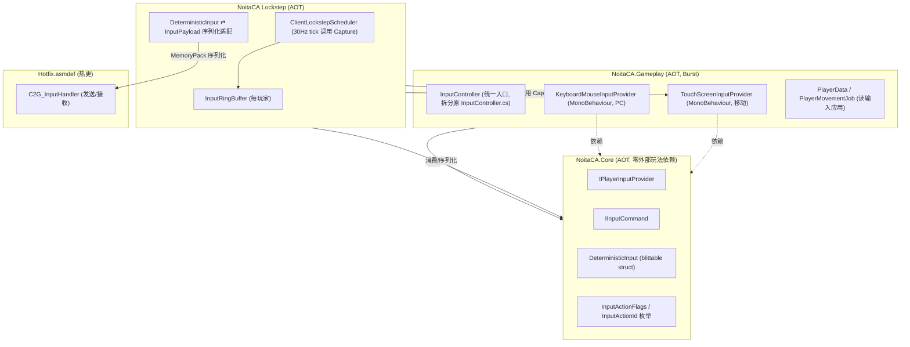
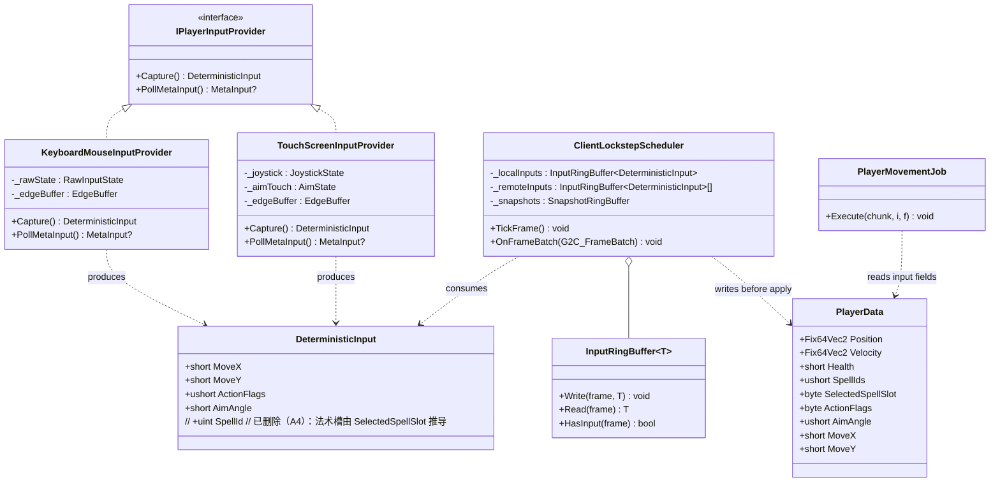
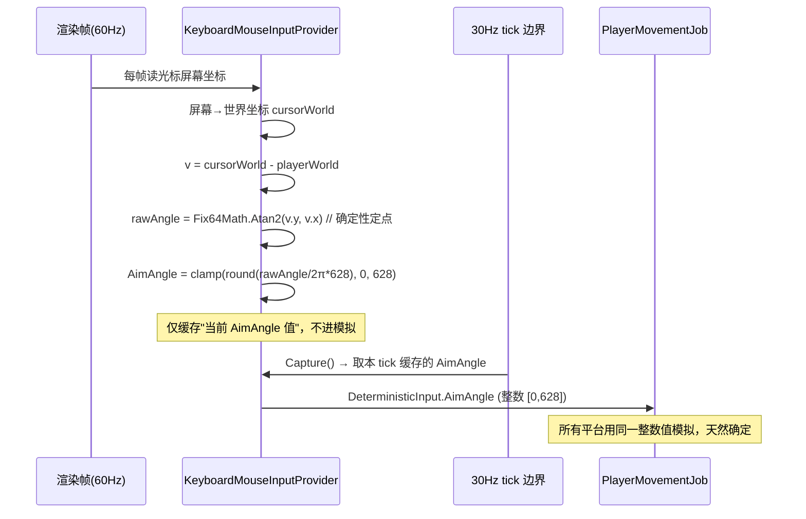
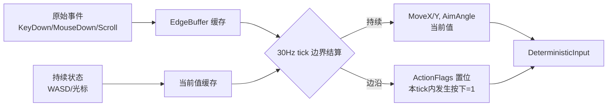
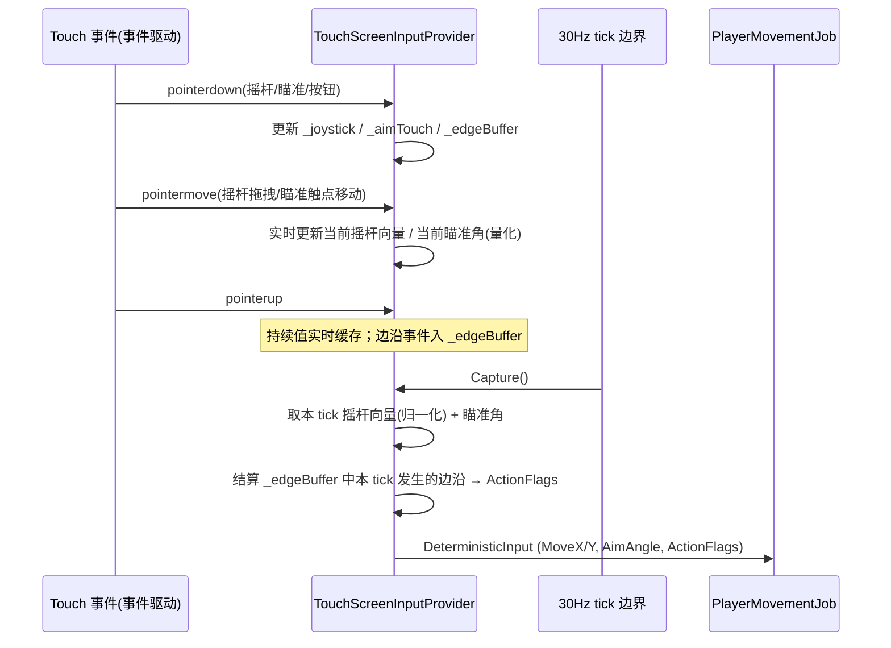
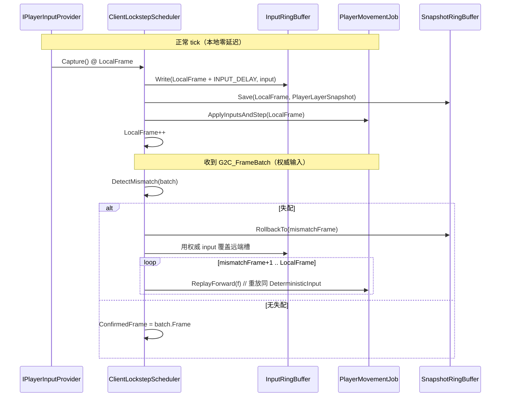

# NoitaCA 跨平台输入架构文档（PC 键鼠 / 移动端触屏 → 帧同步确定性输入）

> **版本**：v1.0
> **日期**：2026-07-07
> **状态**：草稿 / 待评审
> **维护人**：高见远（架构师）
> **配套契约**：`UIUX交互设计.md` §2「抽象输入集」（本文档原样采用其 12 动作语义）
> **上游文档**：`多人联机帧同步对战设计.md` / `帧同步Netcode设计.md` / `玩法重构方案.md` / `开发智能体配置.md`

---

## 1. 概述

### 1.1 文档定位

本文档是《UI/UX 交互设计文档》（许清楚，下称 **UX 文档**）§2「抽象输入集」的**技术落地契约**。UX 文档定义了 12 个动作（语义 + 进/不进确定性流的划分）作为 UX 与技术的唯一契约；本文档负责把这套契约收敛为 30Hz 帧同步的**确定性 `InputPayload`**，并定义 PC 键鼠与移动端触屏两套采集通道如何产生**完全相同结构**的输入。

```
玩家意图（Move / Aim / CastSpell / ... 共12动作）
   │
   ▼
[ 平台采集层 InputProvider ]   ← PC 键鼠 / 移动触屏（两套实现，同一接口）
   │  （边沿检测 + 量化 + 归一化，30Hz tick 边界结算）
   ▼
[ InputPayload（MoveX/Y, AimAngle, ActionFlags）]  ← 确定性输入，本文核心（SpellId 已于 2026-07-07 删除，见 协议与序列化规范.md）
   │
   ▼
[ NoitaCA.Lockstep 调度层（本地预测 + 输入缓冲 + 回滚重放）]
   │
   ▼
[ 确定性模拟（PlayerMovementJob / SpellJob）]  ← 30Hz，所有平台同输入同结果
```

### 1.2 设计目标

| 目标 | 含义 | 落地约束 |
|------|------|---------|
| **跨平台输入一致性** | PC 与移动端对同一玩家意图产生**字节级相同**的 `InputPayload` | 量化（AimAngle [0,628]）、归一化（Move 模长≤100）、整数位运算（ActionFlags），全程无浮点发散 |
| **确定性** | 相同 `InputPayload` 序列在三平台（Win/Mac/Android）跑 10000 帧状态哈希一致 | 复用 `Fix64Math.Atan2`（查表+牛顿），禁用 `Time.deltaTime`，禁用 `Unity.Math` 浮点 |
| **低延迟** | 本地输入零延迟应用（`INPUT_DELAY=2` 帧），远端乐观预测 | 见 §6，输入缓冲 + GGPO 风格回滚 |
| **动作集守恒** | 严格采用 UX §2 的 12 动作，不得新增/删减/改名/拆分语义 | 平台只改变"如何产生动作值" |

### 1.3 与既有架构的对齐承诺

- **协议 wire 结构零破坏**：`InputPayload` 的字段类型/顺序/编号与 `多人联机帧同步对战设计.md` §6.2 **完全一致**，仅扩展 `ActionFlags` 的**位定义**（新增 4 个位）。**注（2026-07-07 收口，A4）**：`SpellId` 字段**已删除**——当前法术槽由 `SelectedSpellSlot` 推导，不再随输入上行。`MemoryPack` 避免破坏性 schema 变更（见 `开发智能体配置.md` §3 与 `协议与序列化规范.md`）。ProtocolVersion 1→2。
- **程序集归属**：遵循 `玩法重构方案.md` 的 5 程序集（Core/Simulation/Renderer/Gameplay/Editor）+ `NoitaCA.Lockstep`（AOT）。输入采集为**主线程 MonoBehaviour**（无法 Burst，因读 Input System / Touch 为托管 API），输入**应用**在 Burst Job。
- **回滚参数**：沿用 `帧同步Netcode设计.md`：`INPUT_DELAY=2`、`MAX_ROLLBACK=7`，扩展动作同样可重放。

---

## 2. 抽象输入层设计

### 2.1 动作契约（严格采用 UX §2 的 12 动作）

> **契约声明**：下表语义、持续/边沿属性、进/不进确定性流的划分，**原样采用 UX §2.1**，架构层不增删改。

| 动作 ID | 中文 | 持续? | 进确定性流? | 映射到 InputPayload | 采集位/字段 |
|--------|------|-------|------------|---------------------|------------|
| `Move` | 移动 | 持续 | ✅ | `MoveX`, `MoveY` | int16 ×100 [−100,100] |
| `Aim` | 瞄准 | 持续 | ✅ | `AimAngle` | int16 ×100 [0,628] |
| `CastSpell` | 释放当前法术 | 边沿 | ✅ | `ActionFlags.Attack` | bit1 |
| `SelectSpellNext` | 切换法术(下一槽) | 边沿 | ✅ | `ActionFlags.SelectNext` | bit6 |
| `SelectSpellPrev` | 切换法术(上一槽) | 边沿 | ✅ | `ActionFlags.SelectPrev` | bit7 |
| `Jump` | 跳跃 | 边沿 | ✅ | `ActionFlags.Jump` | bit0 |
| `Pickup` | 拾取 | 边沿 | ✅ | `ActionFlags.Pickup` | bit4 |
| `Drop` | 丢弃 | 边沿 | ✅ | `ActionFlags.Drop` | bit5 |
| `UseConsumable` | 使用消耗品 | 边沿 | ✅ | `ActionFlags.UseConsumable` | bit8 |
| `Dash` | 冲刺/闪避 | 边沿 | ✅ | `ActionFlags.Dash` | bit9 |
| `PauseMenu` | 暂停/菜单 | 边沿 | ❌（元操作） | —（不进 `InputPayload`） | 仅客户端 UI |
| `QuickChat` | 快捷表情/短语 | 边沿 | ❌（网络事件） | `C2G_ChatMsg(QuickChat)` | 走聊天通道 |

> **保留位说明**：既有协议 `ActionFlags` 已定义 `Spell1`(bit2) / `Spell2`(bit3) 直选标志（见 §2.3）。本文保留这两位作**兼容保留通道**，默认循环切换模型下不使用（见 §10 Q6 架构结论）。
> **作废（2026-07-07，A4）**：`SpellId` 字段已删除——`Spell1/Spell2` 直选通道与 `SelectedSpellSlot` 推导二选一，收口后统一走 `SelectedSpellSlot` 循环切换，输入不再携带法术 ID，详见 `协议与序列化规范.md`。

### 2.2 抽象接口与数据结构

#### 2.2.1 动作位标志（扩展后 ActionFlags 位定义）

```csharp
// 伪代码，仅作设计参考（AOT，blittable，uint16）
// NoitaCA.Core/Input/InputAction.cs
// 约束：位定义与既有协议 InputPayload.ActionFlags(uint16) 字段对齐；
//       仅新增 bit6-9（不破坏既有 bit0-5 语义）。
[Flags]
public enum InputActionFlags : ushort
{
    None          = 0,
    Jump          = 1 << 0,  // 跳跃          (既有)
    Attack        = 1 << 1,  // 释放当前法术  (既有, = CastSpell)
    Spell1        = 1 << 2,  // 直选槽1        (既有, 兼容保留, 默认不用)
    Spell2        = 1 << 3,  // 直选槽2        (既有, 兼容保留, 默认不用)
    Pickup        = 1 << 4,  // 拾取          (既有)
    Drop          = 1 << 5,  // 丢弃          (既有)
    SelectNext    = 1 << 6,  // 切换法术(下一槽) (新增)
    SelectPrev    = 1 << 7,  // 切换法术(上一槽) (新增)
    UseConsumable = 1 << 8,  // 使用消耗品      (新增)
    Dash          = 1 << 9,   // 冲刺/闪避      (新增, Q3 假设存在)
    // bit10-15 保留
}
```

#### 2.2.2 动作语义枚举（12 动作契约，供采集层映射用）

```csharp
// 伪代码（AOT）
// NoitaCA.Core/Input/InputActionId.cs
public enum InputActionId : byte
{
    Move = 0, Aim, CastSpell, SelectSpellNext, SelectSpellPrev,
    Jump, Pickup, Drop, UseConsumable, Dash,
    PauseMenu, QuickChat   // 后两者不进确定性流，仅本地/聊天
}
```

#### 2.2.3 确定性输入结构（架构级，与协议字段对齐）

> **依赖方向说明**：协议生成的 `InputPayload`（MemoryPack）位于 `Client/Assets/Scripts/Hotfix/Generate/NetworkProtocol/`（Hotfix 程序集）。`NoitaCA.Core` 不可反向依赖 Hotfix（见 `玩法重构方案.md` §3.1）。因此 Core 内定义**架构级确定性输入结构** `DeterministicInput`，字段与协议 `InputPayload` 完全一致；`NoitaCA.Lockstep`（AOT）负责 `DeterministicInput` ↔ 协议 `InputPayload` 的零拷贝映射与 MemoryPack 序列化。
>
> 采集层（主线程）→ 产出 `DeterministicInput` → `NoitaCA.Lockstep` 调度 → 序列化为协议 `InputPayload` 发服务器 / 写入 `PlayerData`。

```csharp
// 伪代码（AOT, blittable struct, 字段与协议 InputPayload 严格对齐）
// NoitaCA.Core/Input/DeterministicInput.cs
public struct DeterministicInput : IComponentData  // 也可作普通 struct 在 ring buffer 中
{
    public short  MoveX;        // 定点数 ×100, [-100, 100]  持续输入
    public short  MoveY;        // 定点数 ×100, [-100, 100]  持续输入
    public ushort ActionFlags;  // InputActionFlags 位组合    边沿输入
    public short  AimAngle;     // 定点数 ×100, [0, 628]     持续输入
    // 注：SpellId 字段已删除（2026-07-07 收口，A4）。法术槽由 SelectedSpellSlot 推导，不再入 InputPayload。
}
```

#### 2.2.4 抽象输入提供器接口（T1 落地）

```csharp
// 伪代码（平台无关，AOT）
// NoitaCA.Core/Input/IPlayerInputProvider.cs
public interface IPlayerInputProvider
{
    // 返回当前 30Hz tick 的确定性输入快照（已做边沿检测 + 量化 + 归一化）
    // 持续输入取"本 tick 边界的当前值"；边沿动作取"本 tick 内是否发生过按下"
    DeterministicInput Capture();

    // 本地生成的元操作（不进确定性流）：暂停/快捷表情
    // 返回非 null 表示本 tick 有元操作事件
    MetaInput? PollMetaInput();
}

// 元操作：不进 InputPayload，仅本地 UI / 聊天通道
public struct MetaInput
{
    public InputActionId Action;  // PauseMenu / QuickChat
    public uint QuickChatId;      // QuickChat 时有效（0-15，见 multiplayer-design §7.1）
}
```

#### 2.2.5 抽象命令接口（T1 要求的 IInputCommand）

```csharp
// 伪代码（AOT）
// NoitaCA.Core/Input/IInputCommand.cs
// 单个离散动作的"命令"抽象，供扩展动作(SelectNext/UseConsumable/Dash)做可重放封装
public interface IInputCommand
{
    InputActionId Action { get; }
    // 应用到玩家确定状态（回滚重放时调用），纯函数、无副作用、确定性
    void ApplyTo(ref PlayerCommandState state);
}
```

### 2.3 扩展后 InputPayload（proto / MemoryPack 字段表）

> **关键**：wire 结构与既有协议**完全一致**（字段、类型、顺序、编号均未变），仅 `ActionFlags` 语义扩展。

| 字段 | 类型 | 范围 / 编码 | 量化? | 边沿/持续 | 新增? |
|------|------|------------|-------|----------|-------|
| `MoveX` | int16 | [−100,100]，归一化 ×100 | 是（×100） | 持续 | 既有 |
| `MoveY` | int16 | [−100,100]，归一化 ×100 | 是（×100） | 持续 | 既有 |
| `ActionFlags` | uint16 | 位标志（见 §2.2.1） | 否（位） | 边沿 | **扩展位** bit6-9 |
| `AimAngle` | int16 | [0,628]，×100 表示 [0,2π) | 是（×100） | 持续 | 既有 |
| ~~`SpellId`~~ | uint32 | **已删除（2026-07-07，A4）**——法术槽由 `SelectedSpellSlot` 推导，不再随输入上行 | — | — | 作废 |

```protobuf
// 伪代码，仅作设计参考（字段与 multiplayer-design §6.2 完全一致，仅 ActionFlags 位定义扩展）
// 序列化：// Protocol MemoryPack（高频 30Hz，MemoryPack 比 ProtoBuf 快 5-10×）
message InputPayload
{
    int16  MoveX;        // [-100, 100] ×100
    int16  MoveY;        // [-100, 100] ×100
    uint16 ActionFlags;  // 位标志: Jump/Attack/(Spell1/Spell2保留禁用)/Pickup/Drop/SelectNext/SelectPrev/UseConsumable/Dash
    int16  AimAngle;     // [0, 628] ×100 表示 [0, 2π)
    // 注：SpellId 字段已删除（A4）。当前法术槽由 SelectedSpellSlot 推导，详见 协议与序列化规范.md
}
```

### 2.4 程序集归属（参考 玩法重构方案 §3 / §4.4.5）



**归属结论**：

| 类型 | 程序集 | 热更? | 理由 |
|------|--------|-------|------|
| `IPlayerInputProvider` / `IInputCommand` / `DeterministicInput` / 枚举 | `NoitaCA.Core` | ❌ AOT | 平台无关抽象 + blittable 数据，供两端实现与 Lockstep 共享 |
| `KeyboardMouseInputProvider` / `TouchScreenInputProvider` / `InputController` | `NoitaCA.Gameplay` | ❌ AOT | 主线程 MonoBehaviour，读 Unity Input System / Touch（托管 API，无法 Burst） |
| `PlayerData` / `PlayerMovementJob` | `NoitaCA.Gameplay` | ❌ AOT | 输入应用（Burst Job） |
| `ClientLockstepScheduler` / `InputRingBuffer` / 序列化适配 | `NoitaCA.Lockstep` | ❌ AOT | 帧同步调度，绝不在 Hotfix（multiplayer-design §4.1） |
| `C2G_InputHandler` | `Hotfix` | ✅ | 仅网络收发，不含模拟逻辑 |

> **注意**：`NoitaCA.Lockstep` 不属于 `玩法重构方案.md` 范畴（该文档 §1.4 决策 3 明确），由 netcode 阶段引入；本文档仅消费其接口。

### 2.5 输入系统如何作为 ECS System / Job



**数据流（每 30Hz tick）**：

1. `ClientLockstepScheduler.TickFrame()` 调用**当前 active 的** `IPlayerInputProvider.Capture()`（PC 或移动实现）→ 得到 `DeterministicInput`（已量化/归一化/边沿检测完成）。
2. 调度层把 `DeterministicInput` 写入本地 `InputRingBuffer`（槽 = `LocalFrame + INPUT_DELAY`），**同时**在应用输入前把字段写入对应 `PlayerData`（MoveX/MoveY/AimAngle/ActionFlags）。
3. `PlayerMovementJob`（Burst）读取 `PlayerData` 输入字段 → 应用移动/跳跃/施法/冲刺等。
4. 本地输入序列化为协议 `InputPayload` → `C2G_Input` 发服务器（Hotfix handler）。

> **为何采集是 MonoBehaviour 而非 Job**：读 Unity Input System / Touch 属托管 API，违反 Burst Job「禁托管堆」约束（`开发智能体配置.md` §5.3 / `玩法重构方案.md` §7.3）。因此采集在主线程，仅**产物**（`DeterministicInput`）进入确定性模拟。

---

## 3. PC 键鼠映射

### 3.1 默认键位映射（与 UX §3.1 对齐）

| 动作 | 按键 | 类型 | 量化/处理 |
|------|------|------|----------|
| `Move` | `W/A/S/D` 或方向键 | 持续 | 8 向；斜向归一化（模长=100） |
| `Aim` | 鼠标移动 | 持续 | 玩家中心→光标世界向量→`AimAngle` 量化 [0,628] |
| `CastSpell` | 鼠标左键 | 边沿 | `ActionFlags.Attack` |
| `SelectSpellNext` | `Q` / 滚轮上滚 | 边沿 | `ActionFlags.SelectNext` |
| `SelectSpellPrev` | `E` / 滚轮下滚 | 边沿 | `ActionFlags.SelectPrev` |
| `Jump` | `空格` | 边沿 | `ActionFlags.Jump` |
| `Pickup` | `F` | 边沿 | `ActionFlags.Pickup` |
| `Drop` | `G` | 边沿 | `ActionFlags.Drop` |
| `UseConsumable` | `R` | 边沿 | `ActionFlags.UseConsumable` |
| `Dash` | `左Shift` | 边沿 | `ActionFlags.Dash`（Q3 假设存在） |
| `PauseMenu` | `Esc` | 边沿 | `MetaInput`(PauseMenu)，不进流 |
| `QuickChat` | `1`–`6` / `Z X C V` | 边沿 | `MetaInput`(QuickChat) → 聊天通道 |

### 3.2 鼠标瞄准量化（确定性核心）



**量化公式**：`AimAngle = round(angle / (2π) * 628)`，夹取 [0,628]。
- 分辨率 ≈ 0.01 rad（≈0.57°），足够像素级精度（UX §3.2）。
- **确定性要点**：鼠标屏幕坐标/光标位置本身**不进**模拟；只有量化后整数 `AimAngle` 进流。即使两端鼠标采样时刻不同，只要 tick 边界的 `AimAngle` 整数值一致即一致（回滚时以权威 `InputPayload` 覆盖，见 `帧同步Netcode设计.md` §3.3）。
- 使用 `Fix64Math.Atan2`（查表+牛顿迭代，Burst 兼容），**禁止** `Math.Atan2` 浮点发散。

### 3.3 边沿检测与持续输入



- **持续输入**（`Move`/`Aim`）：每 tick 取"当前值"（键盘状态 / 光标量化角）。
- **边沿输入**（`CastSpell`/`Select*/`Jump`/`Pickup`/`Drop`/`UseConsumable`/`Dash`）：采集层在 30Hz tick 边界将"本 tick 内是否发生过按下"转为对应 `ActionFlags` 位，**长按不连发**（冷却由服务器校验，multiplayer-design §9.2）。
- **滚轮切法术**：每次"刻度变化"算一次边沿（防滚动惯性连切）——`EdgeBuffer` 记录上次刻度，差值>0 → 一次 SelectNext/Prev。

### 3.4 PC 归一化与反作弊对齐（T7）

- 键盘 8 向：(1,0)/(0,1) 等轴向模长=100；(1,1) 斜向 → 归一化 `(71,71)`（模长=100）。
- 归一化公式（定点）：`len = Fix64Math.Sqrt(x²+y²)`；若 `len > 100`（浮点误差容忍，实际键盘仅 0/1 组合），`(x,y) = (x,y)*100/len`。
- 反作弊：服务器 `AntiCheatSystem.ValidateInput`（multiplayer-design §9.2）校验 `|MoveX|≤100 ∧ |MoveY|≤100 ∧ √(MoveX²+MoveY²)≤100`。PC 与移动端归一化方式**必须一致**（见 §4.4 / §7.3）。

---

## 4. 移动端触屏映射

### 4.1 控件与动作映射（与 UX §4.2 对齐）

| 控件 | 位置 | 动作 | 类型 | 处理 |
|------|------|------|------|------|
| 虚拟摇杆 | 左下半屏（锚定） | `Move` | 持续 | 摇杆偏移 → 归一化向量 [−100,100] |
| 瞄准触摸区 | 右半屏任意处 | `Aim` | 持续 | 触点相对玩家屏幕位置向量 → `AimAngle`（同 §3.2 量化） |
| 施法按钮 | 右半屏锚定（≥64pt） | `CastSpell` | 边沿 | `ActionFlags.Attack` |
| 切法术 ◀ / ▶ | 左下方并排（≥48pt） | `SelectSpellPrev/Next` | 边沿 | `ActionFlags.SelectPrev/Next` |
| 道具按钮 | 右上区 | `UseConsumable` | 边沿 | `ActionFlags.UseConsumable` |
| 冲刺按钮 | 右上区 | `Dash` | 边沿 | `ActionFlags.Dash` |
| 暂停按钮 | 顶部右角 | `PauseMenu` | 边沿 | `MetaInput` |
| 快捷表情栏 | 顶部/右滑抽屉 | `QuickChat` | 边沿 | `MetaInput` → 聊天 |
| 双指轻点 | 任意 | `PauseMenu` | 边沿 | `MetaInput`（防误触：双指间隔<200ms） |

### 4.2 触屏采样与边沿



- **持续输入**：事件驱动更新"当前摇杆向量 / 当前瞄准触点"；每 30Hz tick 读取当前值，与 PC 一样在 tick 边界结算。
- **边沿动作**：`pointerdown` 打标，`tick` 边界结算为 `ActionFlags` 位。
- **多点触控**：摇杆（左拇指）+ 瞄准/施法（右拇指）并行不互斥，支持 ≥2 并发触控点（`TouchScreenInputProvider` 维护独立的 `JoystickPointerId` / `AimPointerId` / 按钮指针映射）。

### 4.3 摇杆死区与瞄准量化

- **摇杆死区**：偏移量 < `DeadZone`（默认半径 12%，可设 8%–20%）→ 视为无输入（`MoveX=MoveY=0`），防误触抖动。
- **摇杆归一化**：`offset = (touch - center) / maxRadius`（[−1,1]²）→ `MoveX = clamp(round(offset.x*100), −100, 100)`，`MoveY` 同理（注意屏幕 Y 轴翻转 → 世界 Y 取负）。
- **瞄准量化**：与 PC **完全一致**——触点相对玩家屏幕位置向量 → 世界向量 → `Fix64Math.Atan2` → `AimAngle [0,628]`。两端共用同一量化函数，保证确定性一致。

### 4.4 移动端归一化与反作弊对齐（T7）

- 摇杆死区后归一化，模长严格 ≤100（与 PC 同一归一化函数）。
- 反作弊：同 PC，服务器校验模长 ≤100。即使触屏采样率/DPR 不同，量化后整数向量一致 → 反作弊不区分平台。

---

## 5. 输入采样与帧对齐

### 5.1 30Hz 采样窗口

| 平台 | 采集驱动 | 采样时刻 |
|------|---------|---------|
| PC | Unity 渲染帧（60Hz）→ 主线程读 Input System | 每次渲染帧更新缓存；**30Hz tick 边界取当前值** |
| 移动 | Touch 事件（事件驱动）→ 更新缓存 | 事件实时更新缓存；**30Hz tick 边界取当前值** |

> **核心原则**：采集层**不在事件/渲染帧即时产出 `InputPayload`**，而是把原始输入写入"当前值缓存 + 边沿缓冲"，由 `ClientLockstepScheduler` 在 **30Hz 逻辑 tick 边界**统一调用 `Capture()` 结算。这样 PC（60Hz 渲染）与移动（事件驱动）在**同一逻辑帧边界**产出输入，消除采样率差异。

### 5.2 采样抖动处理

```mermaid
flowchart TD
    A[PC 60Hz 渲染采样] --> C{30Hz tick 边界}
    B[移动 事件驱动采样] --> C
    C --> D[Capture() 结算 DeterministicInput]
    D --> E[写入 InputRingBuffer<br/>槽 = LocalFrame + INPUT_DELAY]
    E --> F[应用输入 + 推进模拟]

    G[时钟同步 NTP/EMA] -.修正.-> H[服务器帧号对齐]
    I[Jitter Buffer 2帧] -.乱序重排.-> C
    J[Catch-up 落后追赶] -.多步同输入.-> C
```

- **PC 抖动**：渲染帧率波动（55–65Hz）不影响——因为输入在逻辑 tick 边界结算，渲染帧只更新缓存。
- **移动抖动**：触屏事件时刻不规则，但持续值取 tick 边界快照、边沿入缓冲在 tick 结算，时刻差异被吸收。
- **时钟同步影响**（参考 `帧同步Netcode设计.md` §6.1）：NTP/EMA 用于对齐服务器帧号；本地预测用 `LocalFrame`，输入采样由本地 tick 驱动，不受时钟偏移直接影响。Catch-up（§6.3）时单 tick 跑多步，每步仍调用 `Capture()` 取"当前输入"——若玩家未改输入，多步用相同 `DeterministicInput`（合法，等于"按住不动"）。
- **Jitter Buffer**（§6.2）：作用于**远端帧批次**（`G2C_FrameBatch`）乱序重排，不影响本地采集。

---

## 6. 输入预测与 GGPO 回滚兼容

### 6.1 参数与缓冲（沿用 帧同步Netcode设计.md §2.3 / §3）

| 参数 | 值 | 输入层含义 |
|------|----|-----------|
| `INPUT_DELAY` | 2 帧（66ms） | 本地输入写入 `LocalFrame+2` 槽；本地**立即渲染**当前帧（零延迟感） |
| `MAX_ROLLBACK` | 7 帧（233ms） | 回滚时重放输入缓冲中的 `DeterministicInput` |
| `SNAPSHOT_BUFFER` | 8 | 每帧存玩家层快照（含 `PlayerData.ActionFlags/AimAngle/MoveX/Y/SelectedSpellSlot`） |

### 6.2 本地预测 + 回滚重放



### 6.3 扩展动作的可重放性（确定性关键）

> **硬约束**：`SelectSpellNext/Prev`、`UseConsumable`、`Dash` 作为 `ActionFlags` 位，**与 `Jump/CastSpell` 同等对待**——全部进 `DeterministicInput`、全部入 `InputRingBuffer`、全部在回滚 `ReplayForward` 时被重放。

- **为什么必须可重放**：回滚时玩家层状态（含 `SelectedSpellSlot`、`Health`、`Position`）需重建到失配帧并重演。若 `SelectNext` 不进流，回滚后法术槽状态会分歧 → desync。
- **`SelectedSpellSlot` 是推导状态**：它由 `ActionFlags.SelectNext/Prev` 确定性自增/自减（循环 0–3），是 `PlayerData` 字段（进快照）。回滚重放 `SelectNext/Prev` 位即重建 `SelectedSpellSlot`，**无需**把 `SelectedSpellSlot` 本身写入 `InputPayload`（符合 UX §2.1「确定性自增」）。
- **`Dash`/`UseConsumable` 同理**：触发后状态变化（位移/状态标记/消耗品生效）全部由模拟根据 `ActionFlags` 位确定性推导，回滚重放即可。注：MVP Dash 为纯位移、无 i-frames（ADR §3），故此处不派生无敌帧。

```csharp
// 伪代码：回滚重放时扩展动作的处理（与 Jump/CastSpell 同一路径）
// PlayerMovementJob.Execute 内（每帧）：
//   if ((input.ActionFlags & SelectNext) != 0) player.SelectedSpellSlot = (byte)((player.SelectedSpellSlot + 1) % 4);
//   if ((input.ActionFlags & SelectPrev) != 0) player.SelectedSpellSlot = (byte)((player.SelectedSpellSlot + 3) % 4);
//   if ((input.ActionFlags & Dash)      != 0) ApplyDash(player, input.AimAngle);
//   if ((input.ActionFlags & UseConsumable) != 0) ApplyConsumable(player);
//   if ((input.ActionFlags & Attack)    != 0) CastSpell(player, player.SpellIds, player.SelectedSpellSlot);
```

---

## 7. 序列化与确定性保证

### 7.1 序列化路径

```
采集层 Capture() → DeterministicInput (Core struct)
   ↓ NoitaCA.Lockstep 序列化适配
协议 InputPayload (MemoryPack, blittable)
   ↓ C2G_Input (MemoryPack) → 服务器中继
G2C_FrameBatch → 所有客户端 → 写回 InputRingBuffer → 模拟
```

- 全程 `MemoryPack`（高频 30Hz，比 ProtoBuf 快 5–10×，见 multiplayer-design §6.2）。
- `DeterministicInput` 与协议 `InputPayload` 字段 1:1，零拷贝映射。

### 7.2 为何 PauseMenu / QuickChat 不进流

| 动作 | 不进流原因 | 通道 |
|------|-----------|------|
| `PauseMenu` | 元操作，仅本地 UI 状态（暂停菜单），**不影响世界状态**；且暂停不暂停模拟（服务器继续锁步，UX §6.2） | 本地 `MetaInput` → UI 状态机 |
| `QuickChat` | 网络事件，纯表现（表情/短语），不影响模拟状态 | `C2G_ChatMsg(QuickChat)`（ProtoBuf，见 multiplayer-design §6.4） |

> **确定性红线**：任何进入 `InputPayload` 的字段都参与锁步哈希（每 60 帧 `C2G_StateHash` 比对，multiplayer-design §5.4）。`PauseMenu`/`QuickChat` 不进流 → 不污染哈希 → 不导致 desync。

### 7.3 反作弊与跨平台归一化

| 风险 | 措施 | 平台一致性 |
|------|------|-----------|
| 移动向量超模长（加速） | 归一化（键盘/摇杆同一函数）+ 服务器 `√(MoveX²+MoveY²)≤100` 校验 | PC/移动用**同一** `NormalizeMove()`（Core 共享） |
| 瞄准精度跨端发散 | `AimAngle` 整数量化 [0,628]（分辨率 0.01rad），`Fix64Math.Atan2` 查表+牛顿 | 两端同函数，无浮点发散 |
| 鼠标 DPI / 触屏采样率差异 | 只在 30Hz tick 边界取量化值，原始采样时刻不入流 | 差异被量化掩盖 |
| 输入频率攻击（同帧重发） | 服务器 `dt = frame - LastInputFrame < 1` 拒绝（multiplayer-design §9.2） | 平台无关 |
| 硬件确定性分歧 | 三平台（Win/Mac/Android）输入哈希一致性校验（见 §8） | `DeterministicInput` 全整数运算 |

### 7.4 三平台输入哈希一致性校验点

- **输入级哈希**：`DeterministicInput` 经 `MurmurHash3`（Core，Burst 兼容，见 `玩法重构方案.md` §4.1.5）生成 32 位输入哈希；同一 `InputPayload` 在三平台哈希一致（全整数字段，无浮点）。
- **集成校验**：输入哈希作为玩家层快照的一部分，参与每 60 帧 `C2G_StateHash` 多数派裁决（multiplayer-design §5.4 / §9.2）。
- **CI 回归**：同输入序列在 Win/Mac/Android 跑 10000 帧，状态哈希一致（验收 `玩法重构方案.md` §12.2）。

---

## 8. 跨平台输入一致性校验（测试策略概要）

> **分工**：本节为架构侧校验点定义；**具体测试用例与执行由 QA 严过关在 `测试QA计划` 落实**（本文不重复测试细节）。

| 校验项 | 方法 | 一致性判据 |
|--------|------|-----------|
| PC↔移动 同意图同 `InputPayload` | 录制 PC 输入序列 → 移动端模拟相同意图（脚本驱动 Provider）→ 比对 `DeterministicInput` 字节 | 字节级相同 |
| AimAngle 量化一致 | 同一世界向量（角度 θ）分别经 PC/移动量化函数 → 比对 `AimAngle` | 整数值相等（[0,628]） |
| Move 归一化一致 | 同一方向（如斜向 45°）键盘(1,1)/摇杆偏移 → 比对 `MoveX/MoveY` | 模长=100，整数相等 |
| 三平台输入哈希 | 同 `InputPayload` 在 Win/Mac/Android 各自 `MurmurHash3` | 32 位哈希相同 |
| 回滚重放一致 | 注入 `SelectNext/Dash/UseConsumable` 失配 → 回滚重放 → 三平台状态哈希 | 一致（无 desync） |
| 端到端 desync | 4 人对局（2 PC + 2 移动）跑 5 分钟，ping 100ms | 0 误报（multiplayer-design §12.2） |

---

## 9. 键位持久化

### 9.1 PC 重映射

- **存储**：本地 `InputRemapProfile`（MemoryPack 或 JSON），键位 → `InputActionId` 映射表。
- **范围**：12 动作中 10 个确定性动作均可改键（`PauseMenu`/`QuickChat` 也可改，但不进流）。
- **不影响确定性**：改键只改变"哪个物理键 → 哪个抽象动作"，**不改变 `InputPayload` 语义/值**。重映射数据**不进确定性流**（本地 UI 状态）。
- **默认**：采用 UX §3.1 默认键位；首次启动写入默认 profile。

### 9.2 移动端按钮布局

- **存储**：本地 `TouchLayoutProfile`（按钮位置/大小/死区，MemoryPack/JSON）。
- **范围**：控件位置可拖拽保存（UX §8 无障碍"控件放大 1.0×–1.5×"）；不影响动作语义。
- **跨端不共享**：PC 与移动 profile 独立，不进确定性流。

### 9.3 持久化结构示例

```csharp
// 伪代码（本地存储，不进确定性流）
// NoitaCA.Gameplay/Input/InputRemapProfile.cs
public struct InputRemapProfile  // PC 重映射（MemoryPack 本地）
{
    public KeyBinding[] Bindings;  // 每个 InputActionId → 物理键/组合
}

public struct TouchLayoutProfile  // 移动布局（MemoryPack 本地）
{
    public TouchControlPos[] Controls;  // 每个控件的位置/尺寸/死区
}
```

---

## 10. 逐条回应 UX §10（T1–T8 / Q1–Q7）

### 10.1 协议 / 输入层待落实（T1–T8）

| # | 技术点 | 架构方案（本文落地） |
|---|--------|---------------------|
| **T1** | 抽象输入层接口 | `NoitaCA.Core/Input/` 定义 `IPlayerInputProvider` + `IInputCommand` + `DeterministicInput`（§2.2）。PC/Touch 两实现同接口，统一产出 `DeterministicInput`。 |
| **T2** | 离散动作边沿检测 | 采集层维护 `EdgeBuffer`，在 30Hz tick 边界将"本 tick 内按下"转 `ActionFlags` 位；长按不连发（冷却服务器校验）。`Capture()` 已完成边沿结算。 |
| **T3** | 采样率对齐 | 采集层不在渲染/事件帧即时产出；由 `ClientLockstepScheduler` 在 30Hz 逻辑 tick 边界统一 `Capture()`（§5）。触屏事件经 `EdgeBuffer` 缓存到下一 tick。 |
| **T4** | `SelectSpell*`/`UseConsumable`/`Dash` 扩展 | `ActionFlags` 扩展 bit6-9（§2.2.1），`InputPayload` wire 结构不变（§2.3）。`SelectedSpellSlot` 为推导状态（PlayerData 字段，由 SelectNext/Prev 自增）。 |
| **T5** | 输入预测兼容 | `InputRingBuffer` + `INPUT_DELAY=2`/`MAX_ROLLBACK=7`；扩展动作同 `Jump/CastSpell` 进缓冲、可重放（§6）。 |
| **T6** | `AimAngle` 量化精度 | 确认 [0,628]（0.01rad ≈0.57°）满足像素级命中；跨端一致，用 `Fix64Math.Atan2`。 |
| **T7** | `MoveX/Y` 归一化与反作弊 | Core 共享 `NormalizeMove()`，键盘/摇杆同一函数；服务器校验模长≤100（§3.4/§4.4/§7.3）。 |
| **T8** | 键位重映射持久化 | 本地 `InputRemapProfile`/`TouchLayoutProfile`（MemoryPack），不影响确定性语义（§9）。 |

### 10.2 玩法 / 设计待确认（Q1–Q7）

| # | 问题 | 架构侧结论 | 标注 |
|---|------|-----------|------|
| **Q1** | 是否需小地图 | **不影响输入层**（纯 HUD）。架构无额外输入字段需求。若采用"边界雷达"，仍只消费 `PlayerData.Position`（已有），不新增输入。 | 待 UX/GDD 决定（不影响本文） |
| **Q2** | 是否有缩圈机制 | **不影响输入层**。架构无需新增输入字段。 | 待 UX/GDD 决定（不影响本文） |
| **Q3** | `Dash` 是否存在 | **架构假设存在**（UX §2 已列 `Dash` 为进确定性流的 12 动作之一）。已落实 `ActionFlags.Dash`(bit9) + 模拟 `ApplyDash`。**若 PM 最终移除**：删除 bit9 + `ApplyDash` 调用，回退干净（见 §11 回溯机制）。 | 待 PM 确认（假设存在推进） |
| **Q4** | HP 死亡语义 | **不影响输入层**（影响 HUD 血条）。架构无需新增输入。 | 待 GDD 决定（不影响本文） |
| **Q5** | 抛物线力度 `AimPower` | **架构侧预留扩展**：当前采用"固定力度"（仅 `AimAngle` 表方向）。若 Q5 确认需要力度输入，新增持续字段 `AimPower`（uint8 ×100, [0,100]）进 `InputPayload`，与 `AimAngle` 同处理（每 tick 采样量化）。`InputPayload` wire 结构届时**增加一个字段**（需 bump 协议版本号 + 客户端版本校验，见 §11）。 | **待 PM/策划确认**（当前默认固定力度） |
| **Q6** | 法术切换模型：循环 vs 直选 | **架构结论 = 循环切换 + 单施法**（移动友好，UX §2.1 提案）：`SelectNext/Prev` 增量维护 `SelectedSpellSlot`(0–3)，`CastSpell` 用 `slots[SelectedSpellSlot]`。既有 `Spell1/Spell2`(bit2/3) **保留为兼容直选通道**，默认不用。此法术选择状态全确定性、可回滚。 | 供 PM 确认（架构建议采纳） |
| **Q7** | 是否手动镜头 | **不影响确定性输入**（镜头纯渲染，灵敏度设置属本地 UI）。架构不新增输入字段；镜头灵敏度设置项不进 `InputPayload`。 | 待 UX 决定（不影响本文） |

---

## 11. 待确认 / 风险

### 11.1 遗留待确认项汇总

| 项 | 来源 | 状态 | 影响 |
|----|------|------|------|
| `Dash` 是否最终保留 | Q3 | 假设存在推进，待 PM 确认 | 若移除，bit9 回退（§11.3） |
| 抛物线力度 `AimPower` 是否需要 | Q5 | 假设固定力度，待确认 | 若需要，新增字段 + 协议版本 bump |
| 法术切换模型（循环 vs 直选） | Q6 | 架构建议循环切换，供确认 | 影响 `SelectedSpellSlot` 推导逻辑 |
| `Dash` 是否消耗资源 / 冷却 | UX §10.1 Q3 备注 | ADR §3 已裁定：MVP 无 i-frames、纯位移、无资源消耗（仅 CD 1.8s），该 Q 已收敛 | 影响 `ApplyDash` 实现（资源/无敌帧） |
| 小地图 / 缩圈 / HP 死亡 / 手动镜头 | Q1/Q2/Q4/Q7 | 不影响输入层 | UX/GDD 决定即可 |

### 11.2 风险登记

| 风险 | 概率 | 影响 | 缓解 |
|------|------|------|------|
| `Dash` 移除导致 `ActionFlags` 位浪费 | 低 | 低 | bit9 保留空位（无功能），或重排位（需协议版本 bump） |
| `AimPower` 后期追加破坏协议兼容 | 中 | 中 | 预留位 / 新增字段 + 协议版本号 + 客户端版本校验（灰度兼容组） |
| 触屏边沿跨 tick 丢失（60Hz 渲染 vs 30Hz tick） | 低 | 中 | `EdgeBuffer` 跨 tick 缓存未结算边沿（§5.2） |
| 双指暂停与双指缩放手势冲突 | 低 | 低 | 双指间隔<200ms + 区域判定区分（UX §4.3） |
| 移动端摇杆死区误触 | 低 | 低 | 死区可配置（§4.3），QA 验收手感 |

### 11.3 动作集变更回溯机制（UX 后续改 12 动作时）

若 UX 文档后续增删/改语义 12 动作之一，遵循以下回溯流程：

1. **新增动作**（如新增 `Grab`）：
   - `InputActionFlags` 增位（bit10-15 预留）；`InputPayload` 若需新字段则**新增字段**（不复用既有字段）→ bump `ProtocolVersion`。
   - 采集层两实现补充映射；模拟层补充 `ApplyXxx`；进 `InputRingBuffer` 可重放。
   - 客户端版本校验（`C2G_ClientVersionReport.ProtocolVersion`）+ 灰度兼容组（multiplayer-design §4.5.6），旧客户端拒绝进对局。
2. **删除动作**（如确认移除 `Dash`）：
   - `InputPayload` wire 结构**不变**（保留字段/位兼容）；仅 `ActionFlags.Dash`(bit9) 置为"保留空位"，模拟层移除 `ApplyDash`。
   - 无需协议版本 bump（向后兼容）。
3. **改语义**（如 `CastSpell` 改成长按连发）：
   - 违反"边沿不连发"原则，须同步改采集层边沿检测 + 服务器冷却校验（multiplayer-design §9.2）；影响确定性，需 QA 全量回归（§8）。
4. **链路校验**：每次变更跑 §8 跨平台一致性校验 + 三平台 10000 帧哈希回归（`玩法重构方案.md` §12.2）。

---

**文档结束**
